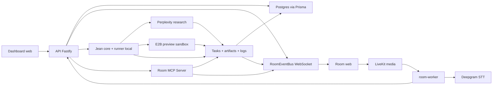

# Roadmap technique par phase

Date de ce point de contexte : 2026-06-17.

Ce dossier sert a garder le fil de construction de Workroom V1. Il reprend la roadmap, puis la recoupe avec le code present dans le repo pour expliquer ce qui a ete pose, pourquoi c'est utile, et comment lire les principaux morceaux techniques.

## Perimetre

- Les phases 0 a 7A sont documentees comme les fondations deja posees.
- La phase 8 est livree jusqu'a 8E : contrat Room <-> Agents, serveur MCP in-process de test, transport MCP HTTP Fastify, auth room/session/agent, et UI minimale Agents / Approvals.
- Les notes expliquent le systeme avec un angle pedagogique, pas comme une specification exhaustive.
- Le code actuel route les recherches vers Perplexity quand `PERPLEXITY_API_KEY` est present, avec fallback mock local.
- `pnpm dev:local` demarre maintenant API + web + room-worker en mode mock pour verifier le flow local sans secrets LiveKit/Deepgram.

## Vue d'ensemble

L'application est pensee comme une room de travail collaborative :

1. des humains entrent dans une room ;
2. LiveKit gere la voix et la video ;
3. un worker ecoute l'audio et le transforme en transcript ;
4. les transcripts finaux peuvent declencher Jean ;
5. Jean cree des tasks et des artifacts ;
6. les updates sont diffusees en live dans le front via WebSocket ;
7. les tasks research peuvent etre executees par Perplexity ;
8. les tasks prototype peuvent produire une preview E2B visible en iframe ;
9. les agents externes peuvent utiliser le contrat Room MCP HTTP pour lire le contexte et ecrire tasks, logs, artifacts, previews et approvals ;
10. les agents et approvals apparaissent dans la room UI, avec replay des events persistants.



## Fiches par phase

- [Phase 0 - Cadrage et contrats techniques](./phase-00-cadrage-et-contrats-techniques.md)
- [Phase 1 - Auth, organisations et room CRUD](./phase-01-auth-orgs-room-crud.md)
- [Phase 2 - LiveKit audio/video](./phase-02-livekit-audio-video.md)
- [Phase 3 - Transcription Deepgram](./phase-03-transcription-deepgram.md)
- [Phase 4 - Jean minimal](./phase-04-jean-minimal.md)
- [Phase 5 - Tasks, artifacts et WebSocket events](./phase-05-tasks-artifacts-websocket-events.md)
- [Phase 6 - Jean runner, Perplexity et stabilisation locale](./phase-06-jean-perplexity-local-dev.md)
- [Phase 7 - E2B prototype connector](./phase-07-e2b-prototype-connector.md)
- [Phase 8 - Room MCP et contrat agents](./phase-08-room-mcp-agents-contract.md)

## Etat actuel apres Phase 8E

Le jalon atteint est le suivant :

```text
Un agent MCP externe, avec un token limite a une room, peut travailler dans une room reelle sans parler au frontend.
```

Ce qui est prouve :

- creation de session agent room-scoped ;
- token signe `roomId + agentId + sessionId` ;
- appel MCP HTTP sur `POST /rooms/:roomId/mcp` ;
- lecture `room.get_context_pack` ;
- creation et claim de task ;
- logs persistants ;
- artifact persistant ;
- preview URL ;
- approval request ;
- affichage UI Agents / Approvals ;
- replay des events task/artifact/audit dans la room.

Ce qui reste volontairement pour la suite :

- Phase 9 : `jean-bridge` + Codex local ;
- Phase 10 : Lovable/v0/Claude connectors ;
- transport SSE/streaming long-running MCP si le besoin se confirme ;
- persistance dediee `AgentRun` et `SandboxSession`.

## Comment utiliser ces notes

Lis d'abord le resume de la phase, puis la section "Pourquoi c'est important". Les chemins de fichiers permettent ensuite d'aller verifier dans le code sans devoir tout comprendre d'un coup.

Chaque fiche suit la meme logique :

- le but fonctionnel ;
- ce qui existe dans le code ;
- la raison technique derriere les choix ;
- les outils utilises, expliques simplement ;
- les fichiers a lire si tu veux creuser.
