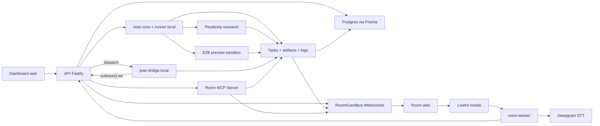

# Roadmap technique par phase

Date de ce point de contexte : 2026-06-19.

Ce dossier sert a garder le fil de construction de Workroom V1. Il reprend la roadmap, puis la recoupe avec le code present dans le repo pour expliquer ce qui a ete pose, pourquoi c'est utile, et comment lire les principaux morceaux techniques.

## Perimetre

- Les phases 0 a 7A sont documentees comme les fondations deja posees.
- La phase 8 est livree jusqu'a 8E : contrat Room <-> Agents, serveur MCP in-process de test, transport MCP HTTP Fastify, auth room/session/agent, et UI minimale Agents / Approvals.
- La phase 9 documente `jean-bridge`, Codex local, le pairing produit, le cockpit agentique et la persistance runs/fichiers/sessions sandbox.
- Les notes expliquent le systeme avec un angle pedagogique, pas comme une specification exhaustive.
- Le code actuel route les recherches vers Perplexity quand `PERPLEXITY_API_KEY` est present, avec fallback mock local.
- `pnpm dev:local` demarre maintenant API + web + room-worker en mode mock pour verifier le flow local sans secrets LiveKit/Deepgram.

## Vue d'ensemble

L'application est pensee comme une room de travail collaborative :

1. des humains entrent dans une room ;
2. LiveKit gere la voix et la video ;
3. un worker ecoute l'audio et le transforme en transcript ;
4. le meme worker peut publier les confirmations vocales courtes de Jean via Deepgram TTS ;
5. les transcripts finaux peuvent declencher Jean ;
6. Jean cree des tasks et des artifacts ;
7. les updates sont diffusees en live dans le front via WebSocket ;
8. les tasks research peuvent etre executees par Perplexity ;
9. les tasks prototype peuvent produire une preview E2B visible en iframe ;
10. les agents externes peuvent utiliser le contrat Room MCP HTTP pour lire le contexte et ecrire tasks, logs, artifacts, previews et approvals ;
11. les agents locaux peuvent se connecter via `jean-bridge` sans exposer la machine de l'utilisateur ;
12. les agents et approvals apparaissent dans la room UI, avec replay des events persistants ;
13. le cockpit agentique distingue room sandbox, user sandboxes, badges agents personnels, Jean action mode, runs Codex, fichiers persistants et previews sandboxees.



## Fiches par phase

- [Phase 0 - Cadrage et contrats techniques](./phase-00-cadrage-et-contrats-techniques.md)
- [Phase 1 - Auth, organisations et room CRUD](./phase-01-auth-orgs-room-crud.md)
- [Phase 2 - LiveKit audio/video](./phase-02-livekit-audio-video.md)
- [Phase 3 - Transcription Deepgram](./phase-03-transcription-deepgram.md)
- [Phase 4 - Jean minimal](./phase-04-jean-minimal.md)
- [Phase 5 - Tasks, artifacts et WebSocket events](./phase-05-tasks-artifacts-websocket-events.md)
- [Phase 6 - Jean runner, Perplexity et stabilisation locale](./phase-06-jean-perplexity-local-dev.md)
- [Phase 7 - E2B prototype connector](./phase-07-e2b-prototype-connector.md)
- [Phase 8 - Room MCP et contrat agents](./phase-08-room-mcp-agents-contract.md)
- [Phase 9 - jean-bridge, Codex local et cockpit agentique](./phase-09-jean-bridge-codex-local.md)
- [Phase 10 - Lovable, v0 et Claude Code](./phase-10-lovable-v0-claude-connectors.md)
- [Phase 11 - Policy Guard, permissions et audit](./phase-11-policy-permissions-audit.md)
- [Phase 12 - Alpha privee](./phase-12-alpha-privee.md)

## Etat actuel apres Phase 12J

Le jalon atteint est le suivant :

```text
Un agent MCP externe ou local bridge, avec un token limite a une room, peut travailler dans une room reelle, publier des fichiers/previews persistants et laisser un audit rejouable. Les agents Lovable, v0 et Claude Code peuvent maintenant etre declares et routes via le bridge local. Le dashboard peut creer une room blank ou pre-seedee via les templates Product Jam, Research Call et Prototype Session.
```

Ce qui est prouve :

- creation de session agent room-scoped ;
- voix courte de Jean : `agent.speech` -> Deepgram TTS -> piste audio LiveKit `jean-voice`, avec throttle et fallback texte-only ;
- token signe `roomId + agentId + sessionId` ;
- appel MCP HTTP sur `POST /rooms/:roomId/mcp` ;
- lecture `room.get_context_pack` ;
- creation et claim de task ;
- logs persistants ;
- artifact persistant ;
- preview URL ;
- approval request ;
- affichage UI Agents / Approvals ;
- replay des events task/artifact/audit dans la room ;
- `jean-bridge` outbound WebSocket ;
- dispatch Jean -> bridge -> agent local ;
- cancellation ;
- pairing produit Codex local depuis la room ;
- separation entre pairing Jean et auth Codex locale ;
- persistence `AgentRun`, events de run, `ArtifactFile`, versions et diffs ;
- cockpit UI : badges agents personnels, room/user sandboxes, Jean action mode, retry/continue, timeline Codex et raw debug ;
- cartes approval enrichies avec scope, payload, horodatage et decision ;
- chargement front des fichiers persistants via `/artifacts/:artifactId/files`, avec fallback `content.files` ;
- comments persistants fichier/ligne/run step branches sur les vrais `AgentRunEvent` ;
- apply-to-local-repo via bridge local, avec approval humaine obligatoire et ecriture bornee au `cwd` du bridge ;
- run checks via bridge local, avec approval humaine obligatoire et execution limitee aux checks declares localement ;
- ownership multi-user signe dans les tokens agent et propage sur `AgentRun` / `AgentRunEvent` ;
- empty/error states du cockpit avec prochaines actions pour Codex local / bridge ;
- persistence `SandboxSession` et tools MCP HTTP `preview.*` ;
- Policy Guard centralise pour publication preview sensible, avec audit `AGENT_TOOL_CALL_BLOCKED` ;
- packaging tarball alpha `@jean/shared` + `@jean/bridge-cli`, avec binaire `jean-bridge`, README package et `pnpm pack` verifie ;
- smoke package hors monorepo `pnpm bridge:smoke:package`, avec installation tarball dans un projet temporaire hors workspace, verification du binaire `jean-bridge`, import `@jean/shared`, doctor packagé, pairing packagé, WebSocket bridge et publication d'artifact via Room MCP contre un serveur Workroom mock ;
- Phase 10A bridge-first : providers persistants `CLAUDE_CODE`, `LOVABLE`, `V0`, `CUSTOM`, config `jean-bridge` compatible, et routage Jean vers Lovable/v0/Claude Code connectes pour tasks code/prototype.
- Phase 10B alpha : connecteur Remote MCP generique env-gated (`WORKROOM_REMOTE_MCP_URL`) qui appelle un tool MCP distant via JSON-RPC `tools/call` et applique le patch artifact retourne.
- Phase 10C alpha v0 : connecteur v0 API env-gated (`V0_API_KEY`) qui cree un chat v0 pour tasks `prototype` / `code`, applique les fichiers/metadonnees retournes et publie la preview URL quand elle existe.
- Phase 11A : historique `AgentToolCall` detaille pour les tools MCP HTTP, avec status, args nettoyes, resultat, erreur, duree, route `/rooms/:roomId/tool-calls` et permissions par capacite agent sur les tools preview/artifact sensibles.
- Phase 11B : panneau UI `Tool calls` dans la room, avec filtres par status, refresh, polling leger et inspection des args/resultats nettoyes.
- Phase 11C : decisions d'approval reservees aux org `OWNER` / `ADMIN` ou room `HOST`, avec test prouvant qu'un `MEMBER` peut lire mais pas approuver.
- Phase 11D : route et panneau read-only `Policy`, exposant le droit courant de decision d'approval et les actions sensibles connues.
- Phase 11E : la route humaine `PATCH /rooms/:roomId/artifacts/:artifactId/preview-url` demande une approval `publish_preview` avant de publier une preview, avec test de non-regression.
- Phase 11F : creation de sessions agent reservee aux org `OWNER` / `ADMIN` ou room `HOST`, exposee dans le panneau `Policy`.
- Phase 11G : administration des membres d'organisation, avec liste `members`, changement `ADMIN` / `MEMBER` reserve aux owners, protection du dernier owner et panneau dashboard.
- Phase 11H : edition admin des regles policy sensibles connues, avec overrides organisation de risk level, impossibilite d'affaiblir une regle sous son niveau de base, API `PATCH /rooms/:roomId/policy/rules/:ruleId` et controle dans le panneau `Policy`.
- Phase 12A : creation de room avec template `blank`, `product_jam`, `research_call` ou `prototype_session`, plus starter task/artifact persiste pour chaque template non blank.
- Phase 12B : onboarding dashboard minimal via `Alpha setup`, avec progression profile, organisation, template et premiere room.
- Phase 12C : route usage organisation et panneau dashboard `Usage`, avec compteurs rooms, tasks, artifacts, agents, approvals et tool calls.
- Phase 12D : limites alpha configurables `WORKROOM_ALPHA_MAX_*`, exposees dans `usage.limits` et visibles dans le panneau `Usage`.
- Phase 12E : waitlist billing manuelle par organisation, avec persistence `BillingWaitlistEntry`, API `billing-waitlist` et panneau dashboard.
- Phase 12F : guide `docs/bridge-installation.md` pour installer/pairer `jean-bridge` en alpha.
- Phase 12G : couts fournisseurs reels saisis manuellement via `ProviderCostEntry`, API `provider-costs` et panneau dashboard `Provider costs`.
- Phase 12H : conversion multi-devise par taux FX manuels `ProviderExchangeRate`, API `provider-exchange-rates`, `convertedSummary` et total converti dans le dashboard.
- Phase 12I : recuperation FX externe a la demande via Frankfurter v2 `providers=ECB`, route `provider-exchange-rates/fetch`, persistance `ProviderExchangeRate` et action dashboard `Fetch ECB rate`.
- Phase 12J : unites fournisseur internes automatiques dans `usage.providerUsage` : minutes LiveKit participants fermees, minutes Deepgram STT, minutes E2B sandbox et failures connecteurs, affichees dans le panneau `Usage`.

Ce qui reste volontairement pour la suite :

- Phase 10D si besoin : OAuth Lovable gere directement par Workroom, plugin Claude Code et connecteurs cloud dedies plus profonds ;
- transport SSE/streaming long-running MCP si le besoin se confirme ;
- Integrations automatiques avec les APIs billing fournisseurs reelles.

## Comment utiliser ces notes

Lis d'abord le resume de la phase, puis la section "Pourquoi c'est important". Les chemins de fichiers permettent ensuite d'aller verifier dans le code sans devoir tout comprendre d'un coup.

Chaque fiche suit la meme logique :

- le but fonctionnel ;
- ce qui existe dans le code ;
- la raison technique derriere les choix ;
- les outils utilises, expliques simplement ;
- les fichiers a lire si tu veux creuser.
