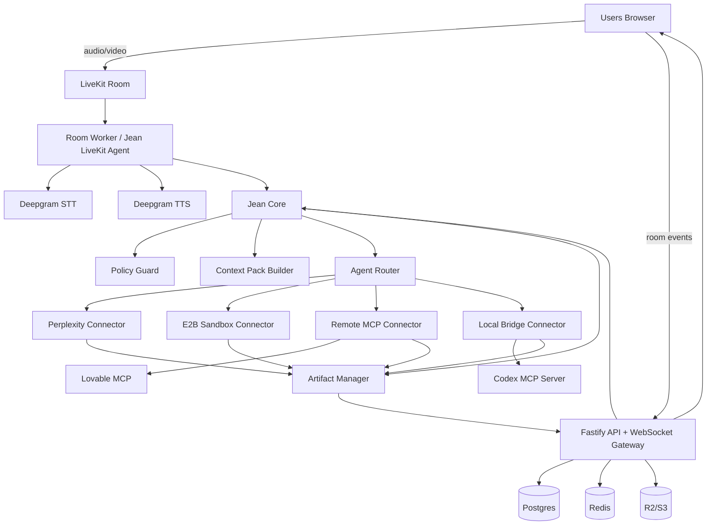

#  V1 — Roadmap produit, stack technique et prompts Codex

> Document de cadrage pour construire une V1 d'un outil de meeting AI-native : une room live où les humains parlent, Jean orchestre, et des agents externes produisent des artefacts visibles en temps réel.

---

## 0. Résumé exécutif

**Nom de travail :** Pas encore chosi
**Positionnement :** un live workspace agentique, pas un clone de Zoom.
**Principe UX :** les visages sont secondaires ; le travail produit en live est central.
**Cœur produit :** un orchestrateur visible, crée des tâches, route vers des agents externes, affiche les artefacts dans des onglets, et bloque les actions sensibles jusqu'à validation humaine.

### V1 en une phrase

Créer une room browser avec audio/vidéo, transcription Deepgram, Jean comme agent vocal sobre, onglets de tâches au centre, artefacts live, Perplexity pour la recherche, E2B pour les previews code, Lovable via MCP, Codex via bridge local/MCP, et un connecteur MCP générique.

### Ce que la V1 doit démontrer

À la fin d'un call, l'équipe n'a pas seulement une transcription ou un résumé. Elle a déjà :

- une spec draftée ;
- des tickets proposés ;
- une recherche sourcée ;
- une preview/prototype ;
- des décisions structurées ;
- un historique auditable des actions de Jean et des agents.

---

## 1. Décision produit fondamentale

### Ce qu'on construit

Un espace de travail synchrone avec :

- une colonne de participants humains à gauche ;
- un canvas central avec des onglets de tâches ;
- Jean et les tâches/validations à droite ;
- audio/vidéo LiveKit ;
- transcription live Deepgram ;
- agents externes branchables via MCP/API/bridge local ;
- artifacts visibles en live.

### Ce qu'on ne construit pas en V1

Ne pas perdre de temps avec :

- breakout rooms ;
- webinar mode ;
- app mobile ;
- avatars 3D réalistes ;
- remplacement complet de Google Calendar ;
- recording vidéo complexe ;
- marketplace publique d'agents ;
- SSO enterprise avancé ;
- agent de code maison censé battre Codex/Claude/Lovable.

---

## 2. Expérience utilisateur V1

### Écran principal

```text
┌──────────────────────────────────────────────────────────────────────────────┐
│ Topbar : Jean Workroom | Room name | Share | Agents | Settings | Leave       │
├───────────────┬──────────────────────────────────────────────┬───────────────┤
│ Participants  │ Workspace central                            │ Jean / Tasks  │
│               │                                              │               │
│ Louis         │ Tabs: [Spec] [Research] [Prototype] [Diagram] │ Jean          │
│ Alice         │                                              │ écoute        │
│ Bob           │ Current tab: artifact renderer                │               │
│               │ - doc / code / iframe / research / diagram   │ Tasks         │
│ Jean          │ - logs streaming                             │ Approvals     │
└───────────────┴──────────────────────────────────────────────┴───────────────┘
```

### Exemple d'usage

```text
Louis : Jean, lance une recherche sur les alternatives à notre onboarding actuel.
Jean : Oui, je m'en occupe. Je crée un onglet de recherche.

→ Onglet "Research — onboarding alternatives" créé.
→ Perplexity stream un rapport sourcé.

Alice : Jean, demande à Codex de faire une preview en trois écrans.
Jean : Je lance Codex sur une preview isolée. Validation requise avant tout push.

→ Onglet "Prototype — onboarding v2" créé.
→ Logs en live.
→ Preview E2B dans iframe.

Bob : Jean, transforme les décisions en tickets.
Jean : Je prépare les tickets en draft, puis je demanderai validation.
```

---

## 3. Stack technique tranchée

### Frontend

```text
Next.js App Router
React
TypeScript
Tailwind CSS
shadcn/ui
LiveKit React Components
TanStack Query
Zustand
Socket.IO client ou ws typé
Monaco Editor
xterm.js
TipTap ou BlockNote
Mermaid
React Flow
iframe sandbox pour previews
```

### Backend

```text
Node.js
TypeScript
Fastify
Socket.IO ou ws
Prisma
PostgreSQL
Redis
BullMQ
Zod
LiveKit Server SDK
LiveKit Agents Node.js
OpenAI Agents SDK / OpenAI API
MCP TypeScript SDK
```

### Voice / meeting

```text
LiveKit Cloud              → audio, vidéo, rooms, participants, tracks
Deepgram STT               → transcription temps réel
Deepgram Aura-2 TTS         → voix courte de Jean
OpenAI / Claude             → cerveau de Jean, parsing, orchestration, context packs
```

### Agents / intégrations

```text
Perplexity API              → recherche web et synthèse sourcée
E2B                         → sandboxes code / previews / exécution isolée
Codex CLI via MCP           → agent code local via bridge
Lovable MCP                 → app builder/prototypes
Generic Remote MCP          → connecteurs distants OAuth/HTTP
Generic Local MCP           → connecteurs locaux via jean-bridge
```

### Infra V1

```text
Render              → Render, frontend Next.js, API Fastify, WebSocket server, room-worker, agent-worker
LiveKit Cloud       → audio/video
Neon Postgres       → DB
Upstash Redis       → queues/events
Cloudflare R2       → fichiers/artifacts
E2B                 → sandboxes
Clerk               → auth
Sentry              → erreurs
Langfuse            → traces LLM
PostHog             → analytics
GitHub Actions      → CI/CD

> Choix pragmatique V1 :
Render pour le code applicatif
+ LiveKit Cloud pour la visio
+ Neon Postgres
+ Upstash Redis
+ Cloudflare R2
+ E2B
+ Clerk

---

## 4. Architecture générale



---

## 5. Monorepo recommandé

```text
workroom/
  apps/
    web/
      app/
      components/
      features/
        room/
        workspace/
        tasks/
        artifacts/
        agents/
        approvals/
      livekit/
      lib/

    api/
      src/
        server.ts
        env.ts
        routes/
          rooms.ts
          livekit.ts
          tasks.ts
          agents.ts
          approvals.ts
          artifacts.ts
          bridge.ts
        websocket/
          gateway.ts
          room-events.ts
        services/
          rooms.service.ts
          tasks.service.ts
          artifacts.service.ts
          approvals.service.ts
          agents.service.ts

    room-worker/
      src/
        index.ts
        livekit-agent.ts
        deepgram-transcriber.ts
        jean-voice.ts
        transcript-ingestor.ts

    agent-worker/
      src/
        index.ts
        task-runner.ts
        connectors/
          perplexity.connector.ts
          e2b.connector.ts
          lovable-mcp.connector.ts
          codex-local.connector.ts
          remote-mcp.connector.ts
          local-mcp.connector.ts
        sandbox/
          e2b-provider.ts

    bridge-cli/
      src/
        index.ts
        auth.ts
        config.ts
        websocket-client.ts
        mcp-stdio-runner.ts
        local-agent-registry.ts

  packages/
    shared/
      src/
        events.ts
        schemas.ts
        ids.ts
        permissions.ts
        context-pack.ts
        artifacts.ts
        tasks.ts

    db/
      prisma/
        schema.prisma
      src/
        client.ts

    jean-core/
      src/
        command-detector.ts
        intent-parser.ts
        context-pack-builder.ts
        policy-guard.ts
        task-planner.ts
        agent-router.ts
        artifact-manager.ts
        approval-manager.ts
        prompts/

    mcp/
      src/
        room-mcp-server.ts
        mcp-client.ts
        oauth.ts
        tools.ts

    ui/
      src/
```

---

## 6. Modèle de données V1

### Tables principales

```text
users
organizations
organization_members
rooms
room_participants
room_agents
transcript_segments
agents
agent_connections
agent_capabilities
tasks
task_events
task_runs
artifacts
artifact_versions
artifact_files
approvals
tool_calls
oauth_connections
audit_logs
sandboxes
sandbox_sessions
```

### Prisma — squelette initial

```prisma
model Room {
  id              String    @id @default(cuid())
  orgId           String
  title           String
  livekitRoomName String    @unique
  createdByUserId String
  createdAt       DateTime  @default(now())
  endedAt         DateTime?

  participants    RoomParticipant[]
  transcripts     TranscriptSegment[]
  tasks           Task[]
}

model RoomParticipant {
  id          String   @id @default(cuid())
  roomId      String
  userId      String?
  displayName String
  type        ParticipantType
  livekitIdentity String?
  joinedAt    DateTime @default(now())
  leftAt      DateTime?

  room        Room @relation(fields: [roomId], references: [id])
}

enum ParticipantType {
  HUMAN
  AGENT
}

model TranscriptSegment {
  id            String   @id @default(cuid())
  roomId        String
  participantId String?
  speakerName   String
  text          String
  isFinal       Boolean
  startedAtMs   Int?
  endedAtMs     Int?
  createdAt     DateTime @default(now())

  room          Room @relation(fields: [roomId], references: [id])
}

model Task {
  id              String     @id @default(cuid())
  roomId          String
  requesterUserId String?
  targetAgentId   String?
  title           String
  goal            String
  status          TaskStatus @default(CREATED)
  riskLevel       RiskLevel  @default(R0)
  createdAt       DateTime   @default(now())
  updatedAt       DateTime   @updatedAt

  room            Room @relation(fields: [roomId], references: [id])
  events          TaskEvent[]
  artifacts       Artifact[]
  approvals       Approval[]
}

enum TaskStatus {
  CREATED
  PLANNING
  WAITING_FOR_PERMISSION
  RUNNING
  STREAMING_OUTPUT
  WAITING_FOR_APPROVAL
  APPLYING
  COMPLETED
  BLOCKED
  FAILED
  CANCELLED
}

enum RiskLevel {
  R0
  R1
  R2
  R3
}

model Artifact {
  id        String         @id @default(cuid())
  roomId    String
  taskId    String
  type      ArtifactType
  title     String
  status    ArtifactStatus @default(DRAFT)
  data      Json?
  createdAt DateTime       @default(now())
  updatedAt DateTime       @updatedAt

  task      Task @relation(fields: [taskId], references: [id])
}

enum ArtifactType {
  DOC
  CODE
  DECK
  DIAGRAM
  RESEARCH
  TABLE
  WORKFLOW
}

enum ArtifactStatus {
  DRAFT
  READY
  APPROVED
  EXPORTED
}

model TaskEvent {
  id        String   @id @default(cuid())
  taskId    String
  type      String
  payload   Json
  createdAt DateTime @default(now())

  task      Task @relation(fields: [taskId], references: [id])
}

model Approval {
  id            String         @id @default(cuid())
  taskId        String
  requestedBy   String?
  resolvedBy    String?
  status        ApprovalStatus @default(PENDING)
  reason        String
  payload       Json
  createdAt     DateTime       @default(now())
  resolvedAt    DateTime?

  task          Task @relation(fields: [taskId], references: [id])
}

enum ApprovalStatus {
  PENDING
  APPROVED
  REJECTED
  EXPIRED
}
```

---

## 7. Event model temps réel

Tout ce qui se passe dans la room doit être émis sous forme d'événements typés.

```ts
export type RoomEvent =
  | { type: "transcript.partial"; roomId: string; speakerId: string; text: string; ts: string }
  | { type: "transcript.final"; roomId: string; speakerId: string; text: string; ts: string }
  | { type: "agent.command.detected"; roomId: string; agentId: string; command: string; requesterId?: string }
  | { type: "task.created"; roomId: string; taskId: string; tabId: string; title: string }
  | { type: "task.status"; roomId: string; taskId: string; status: TaskStatus }
  | { type: "task.log"; roomId: string; taskId: string; message: string; level?: "info" | "warn" | "error" }
  | { type: "artifact.created"; roomId: string; taskId: string; artifactId: string; artifactType: ArtifactType; title: string }
  | { type: "artifact.patch"; roomId: string; artifactId: string; patch: unknown }
  | { type: "artifact.preview_url"; roomId: string; artifactId: string; url: string }
  | { type: "approval.requested"; roomId: string; taskId: string; approvalId: string; reason: string }
  | { type: "approval.resolved"; roomId: string; approvalId: string; approved: boolean }
  | { type: "agent.speech"; roomId: string; agentId: string; text: string };
```

### Règle d'or

- **Redis/WebSocket** : diffusion temps réel.
- **Postgres** : vérité persistée.
- **TaskEvent** : replay/debug/audit.

---

## 8. Jean Core

Jean est visible comme un seul agent, mais en interne il est modulaire.

```text
JeanCore
  TranscriptIngestor
  CommandDetector
  IntentParser
  ContextPackBuilder
  PolicyGuard
  TaskPlanner
  AgentRouter
  ArtifactManager
  ApprovalManager
  VoiceResponder
```

### CommandDetector

Objectif : détecter uniquement les commandes explicites au début.

Exemples valides :

```text
Jean, fais une recherche sur X.
Jean, demande à Codex de faire Y.
Jean, crée une spec à partir de ce qu'on vient de dire.
Jean, prépare les tickets.
Jean, ouvre un onglet diagramme.
```

Exemples non déclenchants :

```text
Il faudrait peut-être faire une recherche.
Ce serait cool d'avoir une preview.
Quelqu'un devrait préparer les tickets.
```

La V1 doit éviter les actions proactives trop agressives.

### IntentParser — sortie structurée

```ts
export const AgentIntentSchema = z.object({
  shouldAct: z.boolean(),
  requesterName: z.string().optional(),
  targetAgent: z.enum(["jean", "codex", "lovable", "perplexity", "e2b", "mcp", "unknown"]),
  taskType: z.enum(["research", "code", "prototype", "doc", "deck", "diagram", "workflow", "unknown"]),
  title: z.string(),
  goal: z.string(),
  outputType: z.enum(["research", "code", "preview", "doc", "deck", "diagram", "tickets", "unknown"]),
  riskLevel: z.enum(["R0", "R1", "R2", "R3"]),
  needsClarification: z.boolean(),
  clarificationQuestion: z.string().optional(),
});
```

### ContextPack

Ne jamais envoyer le transcript brut complet par défaut.

```ts
export type ContextPack = {
  roomId: string;
  taskId: string;
  requester: {
    userId?: string;
    displayName: string;
  };
  goal: string;
  relevantTranscript: Array<{
    speakerName: string;
    text: string;
    ts: string;
  }>;
  decisions: Array<{
    text: string;
    confidence: number;
    sourceSegmentIds: string[];
  }>;
  constraints: string[];
  openQuestions: string[];
  files: Array<{ id: string; name: string; url?: string }>;
  links: Array<{ url: string; label?: string }>;
  artifactTargets: Array<{ artifactId: string; type: string }>;
  permissions: PermissionEnvelope;
};
```

---

## 9. Permissions et validations

### Risk levels

```text
R0 — lecture, résumé, brouillon interne
R1 — création d'artifact interne visible dans la room
R2 — modification d'un outil externe en draft
R3 — publication externe, email, PR, CRM, suppression, paiement, invitation
```

### Politique V1

```text
R0 : autorisé automatiquement
R1 : autorisé automatiquement, log obligatoire
R2 : validation humaine avant export ou write externe
R3 : validation humaine obligatoire + audit log + confirmation explicite
```

### Exemples

```text
Jean, résume les décisions.
→ R0, auto

Jean, crée un onglet spec.
→ R1, auto

Jean, crée les tickets Linear en draft.
→ R2, task possible, export avec approval

Jean, ouvre une PR.
→ R3, approval obligatoire

Jean, envoie le mail au client.
→ R3, draft seulement en V1 ; envoi bloqué
```

---

## 10. Artifacts et onglets

### Types V1

```text
DOC       → spec, notes, compte rendu
RESEARCH  → rapport sourcé, benchmark, synthèse
CODE      → fichiers, diff, logs, preview
DIAGRAM   → Mermaid/React Flow
DECK      → slides HTML/Markdown d'abord, export plus tard
WORKFLOW  → tickets, steps, owners, deadlines
```

### Renderers frontend

```text
DOC       → TipTap ou BlockNote
RESEARCH  → Markdown + citations + table
CODE      → file tree + Monaco + xterm.js + iframe preview
DIAGRAM   → Mermaid + React Flow
DECK      → slide renderer HTML
WORKFLOW  → Kanban/cards
```

---

## 11. Voice stack avec LiveKit + Deepgram

### Architecture

```text
LiveKit Room
  ↓ audio tracks par participant
Room Worker / Jean LiveKit Agent
  ↓
Deepgram STT
  ↓ transcript segments
Jean CommandDetector
  ↓
Task/Artifact events
  ↓
Jean TTS court via Deepgram Aura-2
  ↓
LiveKit Room
```

### Règles produit pour la voix de Jean

Jean ne doit pas parler trop souvent. Il parle pour :

- confirmer une tâche ;
- signaler un blocage ;
- demander validation ;
- annoncer qu'un livrable est prêt.

Exemples de phrases :

```text
Oui, je m'en occupe.
Je crée un onglet pour cette tâche.
J'ai besoin d'une validation avant de continuer.
La première version est prête.
Je suis bloqué : il manque l'accès au repo.
```

---

## 12. Agent Connector Layer

### Objectif

Ne pas rivaliser avec les meilleurs agents spécialisés. Les rendre actionnables en live dans la room.

### Interface interne

```ts
export interface AgentConnector {
  id: string;
  provider: string;
  capabilities: AgentCapability[];
  canHandle(task: Task, context: ContextPack): Promise<boolean>;
  runTask(input: AgentTaskInput): AsyncIterable<AgentTaskEvent>;
  cancelTask?(taskId: string): Promise<void>;
}
```

### Connecteurs V1

#### 1. Perplexity Connector

Usage : recherche web, benchmark, vérification, synthèse sourcée.

```text
Jean → Perplexity Connector → Research Artifact
```

#### 2. E2B Sandbox Connector

Usage : prototypes, code previews, scripts, exécution isolée.

```text
Jean → E2B Sandbox → logs + preview URL → Code Artifact
```

#### 3. Codex Local Connector

Usage : agent code local de l'utilisateur.

```text
Room cloud → jean-bridge WebSocket → codex mcp-server over stdio → events → artifact code
```

#### 4. Lovable MCP Connector

Usage : prototype app builder.

```text
Jean → Lovable MCP → project/preview → prototype artifact
```

#### 5. Generic Remote MCP Connector

Usage : n'importe quel MCP server distant compatible.

```text
Jean → MCP client → Remote MCP server over Streamable HTTP/OAuth
```

#### 6. Generic Local MCP Connector

Usage : serveurs MCP locaux déclarés dans `jean-bridge`.

```text
Jean → backend → jean-bridge → local stdio MCP server
```

---

## 13. `jean-bridge` local

### Pourquoi

Certains agents tournent localement : Codex CLI, Claude Code, OpenClaw, Hermes, serveurs MCP filesystem, outils internes.

On ne veut pas exposer la machine de l'utilisateur sur Internet. Le bridge ouvre une connexion sortante sécurisée.

### Installation V1

```bash
npx jean-bridge login
npx jean-bridge start
```

### Config locale

```yaml
agents:
  codex:
    displayName: "Codex"
    transport: "mcp_stdio"
    command: "codex"
    args: ["mcp-server"]
    capabilities:
      - code.read
      - code.edit_draft
      - tests.run
      - pr.propose
    approval:
      write: required
      external_send: blocked

  local_filesystem:
    displayName: "Local Filesystem"
    transport: "mcp_stdio"
    command: "npx"
    args:
      - "-y"
      - "@modelcontextprotocol/server-filesystem"
      - "/Users/louis/projects"
    capabilities:
      - files.read
      - files.write_draft
```

### Bridge responsibilities

```text
- login OAuth/device code ou token app ;
- connexion WebSocket sortante ;
- heartbeat ;
- déclaration des agents locaux ;
- lancement des processus stdio ;
- mapping MCP messages ↔ room events ;
- logs ;
- kill/cancel task ;
- secrets locaux jamais envoyés dans les prompts.
```

---

## 14. Room MCP Server

Ton app doit aussi exposer un MCP server interne pour que des agents puissent manipuler la room proprement.

### Tools V1

```ts
room.get_context_pack
room.create_task
room.create_tab
room.append_log
room.update_status
room.write_artifact
room.patch_artifact
room.set_preview_url
room.request_approval
room.speak
room.complete_task
```

### Pourquoi c'est important

Sans tools structurés, les agents externes vont rendre du texte brut. Avec le Room MCP Server, ils peuvent produire des événements et artefacts exploitables par ton UI.

---

## 15. Workflow de commande complet

Exemple :

```text
Jean, demande à Codex de faire une preview de l'onboarding en trois écrans.
```

Pipeline :

```text
1. Audio humain arrive dans LiveKit.
2. Room Worker envoie audio à Deepgram.
3. Deepgram retourne transcript final.
4. CommandDetector détecte une commande explicite à Jean.
5. IntentParser produit un JSON typé.
6. ContextPackBuilder prend les segments utiles + décisions + contraintes.
7. PolicyGuard vérifie droits/risk level.
8. Jean dit : "Oui, je lance une preview."
9. Task créée en DB.
10. Event task.created diffusé par WebSocket.
11. Front crée un onglet central.
12. AgentRouter choisit Codex Local Connector.
13. Backend envoie la tâche à jean-bridge.
14. jean-bridge lance codex mcp-server.
15. Logs et outputs reviennent en streaming.
16. ArtifactManager met à jour l'onglet.
17. Preview URL affichée si disponible.
18. Jean annonce : "La première version est prête."
19. Humain valide / demande variante / exporte.
```

---

## 16. Mise en production V1

### Environnements

```text
local
preview
staging
production
```

### Local dev

```bash
pnpm install
pnpm db:generate
pnpm db:migrate
pnpm dev
```

Services nécessaires en local :

```text
Postgres local ou Neon dev branch
Redis local ou Upstash dev
LiveKit Cloud project dev
Deepgram API key
OpenAI API key
E2B API key
Clerk dev keys
```

### Production initiale

```text
apps/web          → Vercel
apps/api          → Render Web Service
apps/room-worker  → Render Worker / Fly Machine
apps/agent-worker → Render Worker / Fly Machine
Postgres          → Neon
Redis             → Upstash ou Redis Cloud
Storage           → Cloudflare R2
Media             → LiveKit Cloud
Auth              → Clerk
```

### Variables d'environnement

```bash
# App
NODE_ENV=production
APP_URL=https://app.jeanworkroom.com
API_URL=https://api.jeanworkroom.com

# Database
DATABASE_URL=postgresql://...

# Redis
REDIS_URL=redis://...

# Auth
CLERK_SECRET_KEY=...
NEXT_PUBLIC_CLERK_PUBLISHABLE_KEY=...

# LiveKit
LIVEKIT_URL=wss://...
LIVEKIT_API_KEY=...
LIVEKIT_API_SECRET=...

# Deepgram
DEEPGRAM_API_KEY=...

# OpenAI
OPENAI_API_KEY=...

# Perplexity
PERPLEXITY_API_KEY=...

# E2B
E2B_API_KEY=...

# Storage
R2_ACCOUNT_ID=...
R2_ACCESS_KEY_ID=...
R2_SECRET_ACCESS_KEY=...
R2_BUCKET=...
```

### CI/CD V1

GitHub Actions :

```text
- install pnpm
- lint
- typecheck
- test
- prisma validate
- build web
- build api
- build workers
```

Déploiement :

```text
- Vercel Git integration pour web
- Render auto-deploy pour api/workers
- migrations Prisma contrôlées manuellement au début
```

---

## 17. Observabilité

### Obligatoire dès V1

```text
Sentry        → erreurs frontend/backend/workers
Langfuse      → traces LLM, prompts, tool calls, coûts
PostHog       → analytics produit
OpenTelemetry → traces inter-services
Audit logs    → actions agents, approvals, tool calls
```

### À logger systématiquement

```text
- room créée ;
- utilisateur rejoint/quitte ;
- transcript final ;
- commande Jean détectée ;
- task créée ;
- agent appelé ;
- contexte envoyé ;
- tool call ;
- artifact modifié ;
- approval demandée/résolue ;
- action externe appliquée ;
- erreur agent/sandbox/bridge.
```

---

## 18. Roadmap V1 par phases

### Phase 0 — Cadrage et contrats techniques

Objectif : figer les types, le monorepo, le data model, les events.

Livrables :

- monorepo Turborepo ;
- packages `shared`, `db`, `jean-core` ;
- Prisma schema initial ;
- Zod schemas ;
- event model ;
- conventions de code ;
- README local dev.

Critère de réussite :

```text
pnpm typecheck passe.
pnpm test passe.
Prisma migrate fonctionne.
```

---

### Phase 1 — Auth, orgs et room CRUD

Livrables :

- Clerk auth ;
- organisations/workspaces ;
- créer une room ;
- rejoindre par lien ;
- page room vide ;
- room participants en DB.

Critère :

```text
Un utilisateur connecté peut créer une room et partager un lien.
```

---

### Phase 2 — LiveKit audio/vidéo

Livrables :

- génération de token LiveKit ;
- connexion room LiveKit ;
- audio/video humains ;
- tuiles participants à gauche ;
- mute/unmute/camera on/off ;
- leave room.

Critère :

```text
Deux utilisateurs peuvent rejoindre une room et se parler avec audio/vidéo.
```

---

### Phase 3 — Transcription Deepgram

Livrables :

- room-worker ;
- subscription aux audio tracks ;
- Deepgram STT ;
- segments transcript partiels/finals ;
- affichage transcript debug ;
- stockage Postgres.

Critère :

```text
La room affiche et stocke les paroles des participants avec speaker attribution.
```

---

### Phase 4 — Jean minimal

Livrables :

- Jean visible dans la room ;
- CommandDetector ;
- IntentParser ;
- réponse textuelle + vocale courte ;
- création de task mock ;
- onglet créé au centre.

Critère :

```text
Dire "Jean, crée une spec" crée une tâche et un onglet.
```

---

### Phase 5 — Tasks, artifacts, WebSocket events

Livrables :

- task lifecycle complet ;
- artifact model ;
- onglets dynamiques ;
- renderers DOC/RESEARCH/CODE basiques ;
- streaming logs ;
- replay events depuis DB.

Critère :

```text
Une task peut streamer des logs et mettre à jour un artifact visible en live.
```

---

### Phase 6 — Perplexity connector

Livrables :

- connecteur Perplexity ;
- recherche sourcée ;
- artifact RESEARCH ;
- streaming ou updates progressifs ;
- sources affichées.

Critère :

```text
"Jean, fais une recherche sur X" produit un rapport sourcé dans un onglet.
```

---

### Phase 7 — E2B prototype connector

Livrables :

- création sandbox E2B ;
- génération/modification fichier simple ;
- lancement dev server ;
- preview URL ;
- iframe dans artifact CODE ;
- logs terminal.

Critère :

```text
"Jean, crée une preview HTML de X" affiche une preview isolée dans l'onglet.
```

---

### Phase 8 — Room MCP Server

Livrables :

- MCP server interne ;
- tools `room.create_tab`, `room.append_log`, `room.write_artifact`, etc. ;
- auth serveur interne ;
- mapping tool calls → RoomEvents.

Critère :

```text
Un agent externe peut créer un onglet et écrire un artifact via MCP.
```

---

### Phase 9 — jean-bridge + Codex local

Livrables :

- CLI bridge ;
- login ;
- WebSocket sortant ;
- config locale ;
- lancement `codex mcp-server` ;
- task dispatch ;
- streaming logs/results ;
- cancellation.

Critère :

```text
Depuis une room, Jean peut déléguer une tâche à Codex local via le bridge.
```

---

### Phase 10 — Lovable MCP connector

Livrables :

- connexion Lovable MCP ;
- création ou update projet ;
- récupération preview ;
- artifact prototype ;
- logs d'itération.

Critère :

```text
Jean peut demander à Lovable de générer un prototype et l'afficher en room.
```

---

### Phase 11 — Policy Guard + approvals + audit

Livrables :

- risk levels ;
- approvals UI ;
- blocage R2/R3 ;
- audit logs ;
- historique tool calls ;
- permissions par org/user/agent.

Critère :

```text
Aucune action externe sensible n'est exécutée sans validation humaine.
```

---

### Phase 12 — Alpha privée

Livrables :

- onboarding simple ;
- 3 templates de room : Product Jam, Research Call, Prototype Session ;
- métriques usage ;
- limites/coûts ;
- billing manuel ou waitlist ;
- documentation d'installation bridge.

Critère :

```text
5 à 10 équipes testent avec de vrais calls et produisent des artefacts utiles.
```

---

## 19. Ordre de développement recommandé

Ordre strict :

```text
1. Monorepo + shared types + DB schema
2. Room CRUD + Auth
3. LiveKit audio/video
4. WebSocket event bus
5. Task/Artifact system
6. Jean CommandDetector mock
7. Deepgram transcription
8. Jean voice confirmations
9. Perplexity connector
10. E2B connector
11. Room MCP Server
12. jean-bridge
13. Codex local
14. Lovable MCP
15. Policy approvals/audit
16. Alpha hardening
```

Ne pas commencer par Codex/Lovable avant d'avoir `Task + Artifact + Event bus`, sinon les outputs n'auront nulle part où vivre.

---

## 20. Comment prompter Codex intelligemment

### Règles générales

Ne jamais demander :

```text
Code toute l'application Jean Workroom.
```

Demander plutôt :

```text
Implémente cette tranche verticale précise, avec tests, types Zod, events et documentation.
```

### Style de prompting

Toujours donner à Codex :

1. le contexte produit ;
2. le scope exact ;
3. les fichiers à créer/modifier ;
4. les contraintes techniques ;
5. ce qui est hors-scope ;
6. les critères d'acceptation ;
7. les commandes à lancer ;
8. l'obligation de ne pas inventer des APIs ;
9. l'obligation de laisser des TODO explicites si une clé/provider manque.

---

## 21. Prompt maître à mettre dans `AGENTS.md`

Créer un fichier `AGENTS.md` à la racine du repo :

```md
# Instructions for Codex Agents

You are building Jean Workroom, an AI-native live meeting workspace.

Core product principle:
- This is not a Zoom clone.
- Human video is secondary.
- The central workspace displays live tasks and artifacts produced by Jean and external agents.

Tech stack:
- Monorepo with pnpm + Turborepo.
- TypeScript first.
- Next.js App Router for `apps/web`.
- Fastify for `apps/api`.
- Prisma + Postgres for persistence.
- Redis + BullMQ for queues/events.
- LiveKit for audio/video rooms.
- Deepgram for STT/TTS.
- MCP for external tool/agent connectors.
- E2B for isolated code sandboxes.

Architecture rules:
- Shared types must live in `packages/shared`.
- Runtime state must be represented as typed events.
- Persist critical events in Postgres.
- Use Redis/WebSocket for fanout only, not as the source of truth.
- Never add agent side effects without approval gates.
- Do not create a monolithic Jean prompt. Jean must be composed of deterministic modules plus LLM calls.

Security rules:
- Never put secrets in prompts.
- Never log raw tokens.
- All R2/R3 actions require human approval.
- Agent outputs must be represented as artifacts, not only free text.

Coding style:
- Use TypeScript strict mode.
- Use Zod for schemas crossing process boundaries.
- Use explicit interfaces for providers/connectors.
- Keep vertical slices small.
- Add tests for pure functions.
- If an external API is uncertain, isolate it behind an adapter and add a TODO with a doc link.

Before editing:
- Inspect the current file tree.
- Read relevant package files.
- Propose a short implementation plan.

After editing:
- Run typecheck/tests if available.
- Summarize changed files.
- Mention any assumptions or missing env vars.
```

---

## 22. Prompts Codex par phase

### Prompt 1 — Initialiser le monorepo

```text
We are starting Jean Workroom V1.

Goal:
Create the initial pnpm + Turborepo monorepo structure for a TypeScript-first app.

Create:
- apps/web: Next.js App Router app with TypeScript
- apps/api: Fastify TypeScript API skeleton
- apps/room-worker: Node TypeScript worker skeleton
- apps/agent-worker: Node TypeScript worker skeleton
- apps/bridge-cli: Node TypeScript CLI skeleton
- packages/shared: shared Zod schemas and types
- packages/db: Prisma package
- packages/jean-core: Jean orchestration core package
- packages/mcp: MCP adapters package
- packages/ui: shared UI package placeholder

Constraints:
- Use pnpm workspaces.
- Use Turborepo.
- Use strict TypeScript.
- Add root scripts: dev, build, typecheck, lint, test, db:generate, db:migrate.
- Do not implement business logic yet.
- Add README with local dev instructions.

Acceptance criteria:
- `pnpm install` works.
- `pnpm typecheck` works.
- Each app has a minimal entry point.
- Packages can import from `@jean/shared`.
```

### Prompt 2 — Shared domain model

```text
Implement the first shared domain model for Jean Workroom.

Scope:
- In packages/shared, define Zod schemas and TypeScript types for:
  - Room
  - RoomParticipant
  - TranscriptSegment
  - Task
  - TaskStatus
  - RiskLevel
  - Artifact
  - ArtifactType
  - ArtifactStatus
  - Approval
  - RoomEvent
  - ContextPack
  - PermissionEnvelope

Constraints:
- All schemas must be runtime-validated with Zod.
- Keep the model minimal but extensible.
- Export inferred TypeScript types.
- Add unit tests for schema parsing.

Out of scope:
- No database implementation.
- No API routes.

Acceptance criteria:
- Types compile.
- Tests cover valid and invalid RoomEvent payloads.
```

### Prompt 3 — Prisma schema

```text
Implement the initial Prisma schema for Jean Workroom using the shared domain model as reference.

Scope:
- Add Prisma schema for users, organizations, rooms, room participants, transcript segments, tasks, task events, artifacts, approvals, agent connections, tool calls, audit logs.
- Add indexes for roomId/taskId/createdAt where useful.
- Add db client export from packages/db.

Constraints:
- Use Postgres.
- Use cuid IDs.
- Keep JSON fields for flexible payloads where appropriate.
- Do not over-normalize agent-specific payloads yet.

Acceptance criteria:
- `pnpm db:generate` passes.
- Prisma schema validates.
```

### Prompt 4 — API room CRUD + LiveKit token endpoint

```text
Implement room CRUD and LiveKit token generation in apps/api.

Scope:
- Fastify server with health route.
- POST /rooms creates a room.
- GET /rooms/:roomId returns room details.
- POST /rooms/:roomId/livekit-token returns a LiveKit access token for a user identity.
- Use Zod validation.
- Use packages/db.

Constraints:
- Keep auth mocked for now with a dev user ID header.
- Do not implement Clerk yet.
- Do not implement WebSocket yet.
- Environment variables must be validated at startup.

Acceptance criteria:
- API starts locally.
- Can create a room and fetch a LiveKit token.
- Invalid payloads return 400.
```

### Prompt 5 — Room UI with LiveKit

```text
Implement the first room UI in apps/web.

Scope:
- Page /rooms/[roomId].
- Fetch room details.
- Request LiveKit token from API.
- Connect to LiveKit room using LiveKit React Components.
- Show participants in a compact left column.
- Main center area has placeholder tabs.
- Right sidebar shows Jean placeholder and task list placeholder.

Constraints:
- Use Tailwind and shadcn/ui.
- Keep video tiles small.
- Do not implement transcription yet.
- Do not implement real tasks yet.

Acceptance criteria:
- Two browser tabs can join the same room.
- Audio/video works.
- Layout matches the product direction: participants left, workspace center, Jean/tasks right.
```

### Prompt 6 — WebSocket event gateway

```text
Implement the room event WebSocket gateway.

Scope:
- Add WebSocket or Socket.IO server in apps/api.
- Clients join a room channel.
- Define event publishing service.
- Persist critical events to TaskEvent or TranscriptSegment where appropriate.
- Add frontend hook `useRoomEvents(roomId)`.
- Show incoming events in a debug panel.

Constraints:
- Use shared RoomEvent schemas for validation.
- Reject invalid events.
- Redis pub/sub adapter can be stubbed in local mode if needed.

Acceptance criteria:
- Backend can broadcast a typed event to all clients in a room.
- Frontend receives and renders debug events.
```

### Prompt 7 — Tasks and artifacts UI

```text
Implement the Task + Artifact system vertical slice.

Scope:
- API endpoints to create task, update task status, append task log, create/update artifact.
- WebSocket events for task.created, task.status, task.log, artifact.created, artifact.patch, artifact.preview_url.
- Frontend central workspace creates a new tab for each task.
- Add artifact renderers for DOC, RESEARCH, CODE placeholders.

Constraints:
- Use shared Zod schemas.
- Persist tasks/artifacts in Postgres.
- The UI must support multiple simultaneous tasks.

Acceptance criteria:
- Creating a task from API creates a new tab live in all connected clients.
- Logs stream into the task tab.
- Artifact content can be patched live.
```

### Prompt 8 — Deepgram transcription worker

```text
Implement the first transcription worker using LiveKit + Deepgram.

Scope:
- apps/room-worker connects to LiveKit room as Jean/system participant.
- Subscribe to human audio tracks.
- Send audio to Deepgram STT.
- Emit transcript.partial and transcript.final events to API/WebSocket.
- Persist final transcript segments.

Constraints:
- Use Deepgram provider behind an STTProvider interface.
- Support one room at a time in dev mode.
- Add clear TODOs for scaling multi-room workers.
- Do not implement command detection yet.

Acceptance criteria:
- Speaking in a room produces transcript events visible in frontend debug panel.
- Final transcript segments are stored.
```

### Prompt 9 — Jean command detector

```text
Implement Jean CommandDetector and IntentParser.

Scope:
- In packages/jean-core, add CommandDetector pure module.
- Detect explicit commands addressed to Jean.
- Add IntentParser that returns structured AgentIntent JSON.
- For now, support task types: research, doc, code, prototype, diagram, workflow.
- Add tests with French and English examples.

Constraints:
- No automatic proactive actions.
- If confidence is low, return shouldAct=false.
- Do not call external agents yet.

Acceptance criteria:
- "Jean, fais une recherche sur X" returns shouldAct=true and taskType=research.
- "Il faudrait faire une recherche" returns shouldAct=false.
```

### Prompt 10 — Jean minimal end-to-end

```text
Create the first end-to-end Jean flow.

Scope:
- Wire transcript.final events into Jean CommandDetector.
- When a valid command is detected, create a Task.
- Create a default Artifact based on task type.
- Emit task.created and artifact.created events.
- Make Jean respond with a short text event agent.speech.
- Frontend displays Jean speech in right sidebar.

Constraints:
- No TTS yet.
- No external connectors yet.
- Use deterministic mapping for now.

Acceptance criteria:
- Saying "Jean, crée une spec" creates a new task tab live.
- Jean displays "Oui, je crée une spec." in the sidebar.
```

### Prompt 11 — Jean TTS via Deepgram

```text
Add short TTS responses for Jean using Deepgram TTS.

Scope:
- Add TTSProvider interface.
- Add DeepgramTTSProvider.
- When agent.speech event is emitted, Jean can publish audio back into LiveKit room.
- Keep voice responses short.

Constraints:
- Do not make Jean conversational yet.
- Add rate limiting so Jean cannot spam audio.
- If TTS fails, fallback to text-only.

Acceptance criteria:
- Jean says "Oui, je m'en occupe" audibly after a valid command.
- UI still works if TTS provider fails.
```

### Prompt 12 — Perplexity connector

```text
Implement Perplexity research connector.

Scope:
- Add AgentConnector interface if not already present.
- Implement PerplexityConnector for research tasks.
- Jean routes research tasks to PerplexityConnector.
- Stream progress logs and update RESEARCH artifact.
- Include source URLs in artifact data.

Constraints:
- Keep provider API isolated.
- Do not mix Perplexity output directly into DB without schema validation.
- Handle provider errors gracefully.

Acceptance criteria:
- Saying "Jean, fais une recherche sur X" creates a research tab and fills it with a sourced report.
```

### Prompt 13 — E2B sandbox connector

```text
Implement E2B sandbox connector for simple prototypes.

Scope:
- Add SandboxProvider interface.
- Implement E2BProvider.
- For prototype tasks, create an E2B sandbox.
- Generate a minimal HTML/React prototype based on task goal.
- Start a dev server if needed.
- Set artifact.preview_url.
- Stream logs into CODE artifact.

Constraints:
- Sandbox must be isolated.
- Never run untrusted shell commands outside E2B.
- Add cleanup/timeout.

Acceptance criteria:
- Saying "Jean, crée une preview simple de X" opens a CODE tab with logs and an iframe preview.
```

### Prompt 14 — Room MCP Server

```text
Implement Room MCP Server package.

Scope:
- Expose MCP tools:
  - room.get_context_pack
  - room.create_task
  - room.create_tab
  - room.append_log
  - room.update_status
  - room.write_artifact
  - room.patch_artifact
  - room.set_preview_url
  - room.request_approval
  - room.speak
  - room.complete_task
- Wire tools to existing API/services.

Constraints:
- Validate all tool inputs with Zod.
- Tool calls must be audit logged.
- R2/R3 tool calls must request approval.

Acceptance criteria:
- A test MCP client can create a task tab and update an artifact.
```

### Prompt 15 — jean-bridge CLI skeleton

```text
Implement jean-bridge CLI skeleton.

Scope:
- CLI commands:
  - jean-bridge login
  - jean-bridge start
  - jean-bridge agents list
- Read config from ~/.jean-bridge/config.yaml.
- Open outbound WebSocket to backend.
- Register local agents from config.
- Heartbeat and reconnect.

Constraints:
- No MCP stdio execution yet.
- Do not store raw cloud tokens in repo.
- Local token should be stored in OS keychain if feasible; otherwise document dev fallback.

Acceptance criteria:
- Running jean-bridge start registers a mock local agent in the room.
```

### Prompt 16 — Codex via jean-bridge

```text
Implement Codex local connector via jean-bridge.

Scope:
- In jean-bridge, support mcp_stdio agents.
- Launch command from config, e.g. `codex mcp-server`.
- Bridge MCP messages between backend task and local stdio process.
- Stream logs/results back as RoomEvents.
- Support cancellation by killing child process.

Constraints:
- Only allow commands explicitly declared in config.
- Never execute arbitrary commands received from cloud.
- Add process timeout.
- Add clear logs and error states.

Acceptance criteria:
- A room task can call local Codex MCP through the bridge and receive output in a CODE artifact.
```

### Prompt 17 — Policy Guard + approvals

```text
Implement PolicyGuard and approvals.

Scope:
- Add risk classification helpers.
- Add approval request API.
- Add approval UI in right sidebar.
- Block R2/R3 actions until approval.
- Add audit logs for approval lifecycle.

Constraints:
- Default deny for unknown actions.
- Approval must record user ID, timestamp, payload, and action type.

Acceptance criteria:
- A simulated R3 action pauses and appears as an approval card.
- Approving resumes the task.
- Rejecting cancels or blocks the action.
```

---

## 23. Prompt de correction/refactor Codex

À utiliser quand une phase commence à devenir sale :

```text
Review the current implementation for the Jean Workroom V1 vertical slice.

Focus on:
- type safety;
- duplicated logic;
- unclear boundaries;
- runtime validation gaps;
- missing error handling;
- persistence vs realtime state confusion;
- places where external provider details leaked into core domain logic.

Do not add new features.

Output:
1. short diagnosis;
2. proposed refactor plan;
3. implement only the highest-impact refactor;
4. run typecheck/tests;
5. summarize changed files.
```

---

## 24. Prompt de test Codex

```text
Add tests for the current module.

Scope:
- Unit tests for pure functions.
- Schema validation tests.
- Connector tests should mock provider APIs.
- WebSocket tests should validate event payloads, not provider internals.

Constraints:
- Do not hit real LiveKit, Deepgram, OpenAI, E2B, Perplexity, or MCP providers in tests.
- Use fixtures.
- Keep tests deterministic.

Acceptance criteria:
- Tests run locally without external credentials.
```

---

## 25. Prompt de sécurité Codex

```text
Security review this vertical slice.

Look specifically for:
- secrets in logs;
- raw tokens in prompts;
- missing approval gates;
- unvalidated WebSocket events;
- unsanitized artifact HTML/iframe usage;
- arbitrary local command execution in bridge;
- overly broad MCP tool permissions;
- missing audit logs.

Do not implement broad rewrites.
Patch the most critical issues and add TODOs for follow-up hardening.
```

---

## 26. Métriques V1

### Produit

```text
- rooms created
- rooms with 2+ humans
- average room duration
- commands addressed to Jean
- tasks created per room
- artifacts created per room
- artifacts approved/exported
- task completion rate
- task failure rate
- time from command to first visible output
```

### Coût

```text
- LiveKit participant minutes
- Deepgram STT minutes
- Deepgram TTS minutes
- LLM input/output tokens
- E2B sandbox minutes
- Perplexity requests
- connector failures
```

### Qualité

```text
- command detection false positives
- command detection false negatives
- transcript latency
- Jean response latency
- time to first artifact update
- approval friction
- user correction rate
```

---

## 27. Alpha privée — scénario de démo cible

### Demo 1 — Research call

```text
Jean, fais une recherche sur les meilleurs onboarding B2B SaaS en 2026.
→ Research artifact avec sources.
```

### Demo 2 — Product spec

```text
Jean, transforme ce qu'on vient de décider en spec.
→ DOC artifact avec contexte, décisions, scope, non-goals, questions ouvertes.
```

### Demo 3 — Prototype

```text
Jean, crée une preview simple de cet onboarding en trois écrans.
→ E2B sandbox + iframe preview.
```

### Demo 4 — Codex local

```text
Jean, demande à Codex de regarder l'impact dans mon repo.
→ Bridge local + Codex MCP + CODE artifact.
```

### Demo 5 — Approval

```text
Jean, prépare une PR.
→ Approval card avant action externe.
```

---

## 28. Principaux risques

### Risque 1 — UX trop confuse

Mitigation : commandes explicites uniquement en V1, task cards claires, statuts visibles.

### Risque 2 — Coûts audio trop élevés

Mitigation : Deepgram, STT par participant, logs coût par room, limiter rooms longues en alpha.

### Risque 3 — Agents externes produisent du chaos

Mitigation : Agent Connector Layer, artifacts typés, approvals, Room MCP Server.

### Risque 4 — Bridge local dangereux

Mitigation : allowlist de commandes, config locale explicite, pas d'exécution arbitraire cloud → local, timeouts, audit.

### Risque 5 — Démo magique mais pas utile

Mitigation : viser des workflows concrets : product jam, research call, prototype session.

---

## 29. Critère de succès V1

La V1 est réussie si :

```text
Une équipe de 3 personnes peut faire un call de 30 minutes,
appeler Jean 5 à 10 fois,
obtenir au moins 3 artefacts utiles,
et finir la réunion avec un livrable déjà exploitable.
```

---

## 30. Références techniques à vérifier régulièrement

- OpenAI Codex SDK : https://developers.openai.com/codex/sdk
- OpenAI Codex CLI reference : https://developers.openai.com/codex/cli/reference
- OpenAI Agents SDK : https://developers.openai.com/api/docs/guides/agents
- OpenAI Agents guardrails/human review : https://developers.openai.com/api/docs/guides/agents/guardrails-approvals
- LiveKit Agents : https://docs.livekit.io/agents/
- LiveKit React Components : https://docs.livekit.io/reference/components/react/
- LiveKit Deepgram STT : https://docs.livekit.io/agents/models/stt/deepgram/
- LiveKit Deepgram TTS : https://docs.livekit.io/agents/models/tts/deepgram/
- Deepgram LiveKit integration : https://developers.deepgram.com/docs/livekit-integration
- MCP Authorization : https://modelcontextprotocol.io/specification/draft/basic/authorization
- E2B docs : https://e2b.dev/docs
- E2B public sandbox URLs : https://e2b.dev/docs/sandbox/internet-access
- Render WebSockets : https://render.com/docs/websocket
- Next.js on Vercel : https://vercel.com/docs/frameworks/full-stack/nextjs
- Clerk Organizations : https://clerk.com/docs/guides/organizations/overview

---

## 31. Dernière recommandation

Le piège serait de demander à Codex de construire “toute l'app” d'un coup. Le bon usage de Codex ici est :

```text
contrats typés → vertical slice → tests → intégration → refactor → connecteur suivant
```

La première vraie milestone utile n'est pas “Codex connecté”. C'est :

```text
Dire “Jean, crée une spec” dans une room audio/vidéo,
et voir un onglet apparaître en live avec une task et un artifact.
```

Une fois cette boucle produite, tous les connecteurs deviennent des variantes du même pattern.
