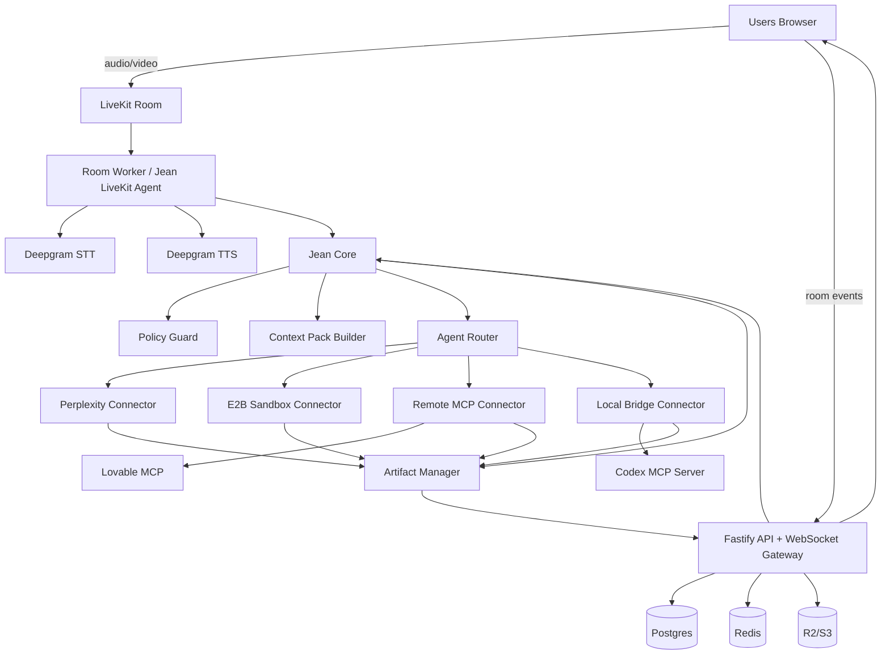

#  V1 — Roadmap produit, stack technique et prompts Codex

> Document de cadrage pour construire une V1 d'un outil de meeting AI-native : une room live où les humains parlent, Jean orchestre, et des agents externes produisent des artefacts visibles en temps réel.

---

## 0. Résumé exécutif

**Nom de travail :** Pas encore chosi
**Positionnement :** un live workspace agentique, pas un clone de Zoom.
**Principe UX :** les visages sont secondaires ; le travail produit en live est central.
**Cœur produit :** un orchestrateur visible, crée des tâches, route vers des agents externes, affiche les artefacts dans des onglets, et bloque les actions sensibles jusqu'à validation humaine.

### V1 en une phrase

Créer une room browser avec audio/vidéo, transcription Deepgram, Jean comme orchestrateur visible, un room sandbox commun, des sandboxes personnels attachés aux users, des artefacts live, Perplexity pour la recherche, E2B pour les previews code, Lovable via MCP, Codex via bridge local/MCP, et un connecteur MCP générique.

### Ce que la V1 doit démontrer

À la fin d'un call, l'équipe n'a pas seulement une transcription ou un résumé. Elle a déjà :

- une spec draftée ;
- des tickets proposés ;
- une recherche sourcée ;
- une preview/prototype ;
- des décisions structurées ;
- un historique auditable des actions de Jean et des agents.

---

## 1. Décision produit fondamentale

### Ce qu'on construit

Un espace de travail synchrone avec :

- des tuiles participants avec leurs agents personnels visibles en badges ;
- un room sandbox commun accessible en cliquant Jean ;
- un user sandbox accessible en cliquant la tuile d'un participant ;
- une scene centrale pour les artefacts partages et les previews publiees ;
- une timeline/actions/validations lisible pendant le call ;
- audio/vidéo LiveKit ;
- transcription live Deepgram ;
- agents externes branchables via MCP/API/bridge local ;
- artifacts visibles en live.

### Ce qu'on ne construit pas en V1

Ne pas perdre de temps avec :

- breakout rooms ;
- webinar mode ;
- app mobile ;
- avatars 3D réalistes ;
- remplacement complet de Google Calendar ;
- recording vidéo complexe ;
- marketplace publique d'agents ;
- SSO enterprise avancé ;
- agent de code maison censé battre Codex/Claude/Lovable.

---

## 2. Expérience utilisateur V1

### Modèle UX validé : room stage + sandboxes personnels

La room ne doit pas etre un clone de visio avec un chatbot ajoute. Le modele
mental retenu est :

```text
Room Stage
  Ce que tout le monde voit : artefact actif, preview partagee, decisions,
  approvals, timeline commune.

Jean / Room Sandbox
  Espace commun de la room : notes live, actions proposees, agents de room,
  contexte partage, historique des decisions.

User Sandbox
  Espace personnel d'un participant : ses agents, ses terminaux, ses brouillons,
  ses credentials, ses tasks en cours.
```

Regle produit :

```text
Le travail peut se faire dans un user sandbox, mais les resultats importants
sont promus vers le Room Stage quand ils doivent devenir visibles/actionnables
par tous.
```

Exemples :

- cliquer sur `Jean` ouvre le room sandbox ;
- cliquer sur la camera de `Louis` ouvre le sandbox de Louis ;
- les agents personnels de Louis sont affiches comme badges attaches a sa tuile ;
- une preview generee par le Codex de Louis apparait d'abord dans son sandbox,
  puis peut etre partagee dans le stage commun ;
- les agents natifs de la room, comme recherche, notes, deck builder ou diagrammes,
  vivent cote Jean/room sandbox plutot que sous un user.

### Agents personnels vs agents de room

Il faut eviter l'ambiguite "cet agent agit avec les droits de qui ?".

```text
Agents personnels
  Attaches a une tuile user.
  Utilisent les credentials, la machine, les connecteurs ou les permissions du user.
  Exemples : Codex local, Claude Code, Gmail, WhatsApp, Linear perso.

Agents de room
  Attaches a Jean / room sandbox.
  Utilisent les droits de la room, de l'organisation ou de Jean.
  Exemples : note taker, recherche web, deck builder Jean, diagram builder.
```

UI recommandee :

- afficher 1 a 3 badges agents maximum sur chaque tuile user ;
- utiliser un compteur `+N` si le user a plus d'agents ;
- rendre les statuts visibles sans bruit : `idle`, `working`, `approval needed`,
  `blocked` ;
- ouvrir le detail complet au clic sur la tuile user ;
- dupliquer les actions importantes dans la timeline commune.

### Jean : transcription permanente, action explicite

Jean peut transcrire et structurer la reunion en continu, mais il ne doit pas
declencher des actions arbitraires parce qu'il "pense avoir compris" une phrase
dans un call a plusieurs personnes.

La V1 utilise une autonomie progressive :

```text
Niveau 1 - manuel
  Mention, bouton, commande ecrite, clic sur agent.

Niveau 2 - suggestion
  Jean detecte une action possible et propose une carte.

Niveau 3 - preparation
  Jean prepare un brouillon, une task ou une action, puis attend validation.

Niveau 4 - execution autonome
  Reserve aux actions faibles risques et aux habitudes tres claires.
```

Etats UX de Jean :

```text
Jean passif
  Transcrit, resume, detecte des signaux faibles, n'execute rien.

Jean arme / ecoute active
  Declenche par clic sur le badge Jean, mention "Jean", ou commande ecrite.
  Pendant une fenetre courte, Jean cherche une intention actionnable.

Jean execution
  Cree la task, route vers l'agent, stream logs/results, demande approval si besoin.
```

Regle V1 :

```text
Jean ecoute toujours pour transcript/resume, mais n'agit que quand il est
explicitement appele : clic, mention "Jean", commande ecrite ou action UI.
```

Cette regle reduit les faux positifs, en particulier dans les calls a 10+
personnes ou la transcription, les interruptions et les pronoms rendent
l'orchestration autonome trop fragile.

### Écran principal

```text
┌──────────────────────────────────────────────────────────────────────────────┐
│ Topbar : Jean Workroom | Room name | Share | Settings | Leave                │
├──────────────────────────────────────────────────────────────────────────────┤
│ Users rail : [Louis + agents] [Alice + agents] [Jean] [Bob + agents] [...]   │
├──────────────────────────────────────────────────────────────────────────────┤
│                                                                              │
│                            Room Stage / Sandbox actif                        │
│                                                                              │
│         artifact actif | preview | terminal agent | doc | deck | diagram     │
│                                                                              │
├───────────────────────────────┬──────────────────────────────────────────────┤
│ Agent/tool dock optionnel      │ Timeline : tasks, logs, approvals, decisions │
└───────────────────────────────┴──────────────────────────────────────────────┘
```

### Exemple d'usage

```text
Louis : Jean, lance une recherche sur les alternatives à notre onboarding actuel.
Jean : Oui, je m'en occupe. Je crée un onglet de recherche.

→ Onglet "Research — onboarding alternatives" créé.
→ Perplexity stream un rapport sourcé.

Alice : Jean, demande à Codex de faire une preview en trois écrans.
Jean : Je lance Codex sur une preview isolée. Validation requise avant tout push.

→ Onglet "Prototype — onboarding v2" créé.
→ Logs en live.
→ Preview E2B dans iframe.

Bob : Jean, transforme les décisions en tickets.
Jean : Je prépare les tickets en draft, puis je demanderai validation.
```

---

## 3. Stack technique tranchée

### Frontend

```text
Next.js App Router
React
TypeScript
Tailwind CSS
shadcn/ui
LiveKit React Components
TanStack Query
Zustand
Socket.IO client ou ws typé
Monaco Editor
xterm.js
TipTap ou BlockNote
Mermaid
React Flow
iframe sandbox pour previews
```

### Backend

```text
Node.js
TypeScript
Fastify
Socket.IO ou ws
Prisma
PostgreSQL
Redis
BullMQ
Zod
LiveKit Server SDK
LiveKit Agents Node.js
OpenAI Agents SDK / OpenAI API
MCP TypeScript SDK
```

### Voice / meeting

```text
LiveKit Cloud              → audio, vidéo, rooms, participants, tracks
Deepgram STT               → transcription temps réel
Deepgram Aura-2 TTS         → voix courte de Jean
OpenAI / Claude             → cerveau de Jean, parsing, orchestration, context packs
```

### Agents / intégrations

```text
Perplexity API              → recherche web et synthèse sourcée
E2B                         → sandboxes code / previews / exécution isolée
Codex CLI via MCP           → agent code local via bridge
Lovable MCP                 → app builder/prototypes
Generic Remote MCP          → connecteurs distants OAuth/HTTP
Generic Local MCP           → connecteurs locaux via jean-bridge
```

### Infra V1

```text
Render              → Render, frontend Next.js, API Fastify, WebSocket server, room-worker, agent-worker
LiveKit Cloud       → audio/video
Neon Postgres       → DB
Upstash Redis       → queues/events
Cloudflare R2       → fichiers/artifacts
E2B                 → sandboxes
Clerk               → auth
Sentry              → erreurs
Langfuse            → traces LLM
PostHog             → analytics
GitHub Actions      → CI/CD

> Choix pragmatique V1 :
Render pour le code applicatif
+ LiveKit Cloud pour la visio
+ Neon Postgres
+ Upstash Redis
+ Cloudflare R2
+ E2B
+ Clerk

---

## 4. Architecture générale



---

## 5. Monorepo recommandé

```text
workroom/
  apps/
    web/
      app/
      components/
      features/
        room/
        workspace/
        tasks/
        artifacts/
        agents/
        approvals/
      livekit/
      lib/

    api/
      src/
        server.ts
        env.ts
        routes/
          rooms.ts
          livekit.ts
          tasks.ts
          agents.ts
          approvals.ts
          artifacts.ts
          bridge.ts
        websocket/
          gateway.ts
          room-events.ts
        services/
          rooms.service.ts
          tasks.service.ts
          artifacts.service.ts
          approvals.service.ts
          agents.service.ts

    room-worker/
      src/
        index.ts
        livekit-agent.ts
        deepgram-transcriber.ts
        jean-voice.ts
        transcript-ingestor.ts

    agent-worker/
      src/
        index.ts
        task-runner.ts
        connectors/
          perplexity.connector.ts
          e2b.connector.ts
          lovable-mcp.connector.ts
          codex-local.connector.ts
          remote-mcp.connector.ts
          local-mcp.connector.ts
        sandbox/
          e2b-provider.ts

    bridge-cli/
      src/
        index.ts
        auth.ts
        config.ts
        websocket-client.ts
        mcp-stdio-runner.ts
        local-agent-registry.ts

  packages/
    shared/
      src/
        events.ts
        schemas.ts
        ids.ts
        permissions.ts
        context-pack.ts
        artifacts.ts
        tasks.ts

    db/
      prisma/
        schema.prisma
      src/
        client.ts

    jean-core/
      src/
        command-detector.ts
        intent-parser.ts
        context-pack-builder.ts
        policy-guard.ts
        task-planner.ts
        agent-router.ts
        artifact-manager.ts
        approval-manager.ts
        prompts/

    mcp/
      src/
        room-mcp-server.ts
        mcp-client.ts
        oauth.ts
        tools.ts

    ui/
      src/
```

---

## 6. Modèle de données V1

### Tables principales

```text
users
organizations
organization_members
rooms
room_participants
room_agents
transcript_segments
agents
agent_connections
agent_capabilities
tasks
task_events
task_runs
artifacts
artifact_versions
artifact_files
approvals
tool_calls
oauth_connections
audit_logs
sandboxes
sandbox_sessions
```

### Prisma — squelette initial

```prisma
model Room {
  id              String    @id @default(cuid())
  orgId           String
  title           String
  livekitRoomName String    @unique
  createdByUserId String
  createdAt       DateTime  @default(now())
  endedAt         DateTime?

  participants    RoomParticipant[]
  transcripts     TranscriptSegment[]
  tasks           Task[]
}

model RoomParticipant {
  id          String   @id @default(cuid())
  roomId      String
  userId      String?
  displayName String
  type        ParticipantType
  livekitIdentity String?
  joinedAt    DateTime @default(now())
  leftAt      DateTime?

  room        Room @relation(fields: [roomId], references: [id])
}

enum ParticipantType {
  HUMAN
  AGENT
}

model TranscriptSegment {
  id            String   @id @default(cuid())
  roomId        String
  participantId String?
  speakerName   String
  text          String
  isFinal       Boolean
  startedAtMs   Int?
  endedAtMs     Int?
  createdAt     DateTime @default(now())

  room          Room @relation(fields: [roomId], references: [id])
}

model Task {
  id              String     @id @default(cuid())
  roomId          String
  requesterUserId String?
  targetAgentId   String?
  title           String
  goal            String
  status          TaskStatus @default(CREATED)
  riskLevel       RiskLevel  @default(R0)
  createdAt       DateTime   @default(now())
  updatedAt       DateTime   @updatedAt

  room            Room @relation(fields: [roomId], references: [id])
  events          TaskEvent[]
  artifacts       Artifact[]
  approvals       Approval[]
}

enum TaskStatus {
  CREATED
  PLANNING
  WAITING_FOR_PERMISSION
  RUNNING
  STREAMING_OUTPUT
  WAITING_FOR_APPROVAL
  APPLYING
  COMPLETED
  BLOCKED
  FAILED
  CANCELLED
}

enum RiskLevel {
  R0
  R1
  R2
  R3
}

model Artifact {
  id        String         @id @default(cuid())
  roomId    String
  taskId    String
  type      ArtifactType
  title     String
  status    ArtifactStatus @default(DRAFT)
  data      Json?
  createdAt DateTime       @default(now())
  updatedAt DateTime       @updatedAt

  task      Task @relation(fields: [taskId], references: [id])
}

enum ArtifactType {
  DOC
  CODE
  DECK
  DIAGRAM
  RESEARCH
  TABLE
  WORKFLOW
}

enum ArtifactStatus {
  DRAFT
  READY
  APPROVED
  EXPORTED
}

model TaskEvent {
  id        String   @id @default(cuid())
  taskId    String
  type      String
  payload   Json
  createdAt DateTime @default(now())

  task      Task @relation(fields: [taskId], references: [id])
}

model Approval {
  id            String         @id @default(cuid())
  taskId        String
  requestedBy   String?
  resolvedBy    String?
  status        ApprovalStatus @default(PENDING)
  reason        String
  payload       Json
  createdAt     DateTime       @default(now())
  resolvedAt    DateTime?

  task          Task @relation(fields: [taskId], references: [id])
}

enum ApprovalStatus {
  PENDING
  APPROVED
  REJECTED
  EXPIRED
}
```

---

## 7. Event model temps réel

Tout ce qui se passe dans la room doit être émis sous forme d'événements typés.

```ts
export type RoomEvent =
  | { type: "transcript.partial"; roomId: string; speakerId: string; text: string; ts: string }
  | { type: "transcript.final"; roomId: string; speakerId: string; text: string; ts: string }
  | { type: "agent.command.detected"; roomId: string; agentId: string; command: string; requesterId?: string }
  | { type: "task.created"; roomId: string; taskId: string; tabId: string; title: string }
  | { type: "task.status"; roomId: string; taskId: string; status: TaskStatus }
  | { type: "task.log"; roomId: string; taskId: string; message: string; level?: "info" | "warn" | "error" }
  | { type: "artifact.created"; roomId: string; taskId: string; artifactId: string; artifactType: ArtifactType; title: string }
  | { type: "artifact.patch"; roomId: string; artifactId: string; patch: unknown }
  | { type: "artifact.preview_url"; roomId: string; artifactId: string; url: string }
  | { type: "approval.requested"; roomId: string; taskId: string; approvalId: string; reason: string }
  | { type: "approval.resolved"; roomId: string; approvalId: string; approved: boolean }
  | { type: "agent.speech"; roomId: string; agentId: string; text: string };
```

### Règle d'or

- **Redis/WebSocket** : diffusion temps réel.
- **Postgres** : vérité persistée.
- **TaskEvent** : replay/debug/audit.

---

## 8. Jean Core

Jean est visible comme un seul agent, mais en interne il est modulaire.

```text
JeanCore
  TranscriptIngestor
  CommandDetector
  IntentParser
  ContextPackBuilder
  PolicyGuard
  TaskPlanner
  AgentRouter
  ArtifactManager
  ApprovalManager
  VoiceResponder
```

### CommandDetector

Objectif : détecter uniquement les commandes explicites au début.

Exemples valides :

```text
Jean, fais une recherche sur X.
Jean, demande à Codex de faire Y.
Jean, crée une spec à partir de ce qu'on vient de dire.
Jean, prépare les tickets.
Jean, ouvre un onglet diagramme.
```

Exemples non déclenchants :

```text
Il faudrait peut-être faire une recherche.
Ce serait cool d'avoir une preview.
Quelqu'un devrait préparer les tickets.
```

La V1 doit éviter les actions proactives trop agressives.

### IntentParser — sortie structurée

```ts
export const AgentIntentSchema = z.object({
  shouldAct: z.boolean(),
  requesterName: z.string().optional(),
  targetAgent: z.enum(["jean", "codex", "lovable", "perplexity", "e2b", "mcp", "unknown"]),
  taskType: z.enum(["research", "code", "prototype", "doc", "deck", "diagram", "workflow", "unknown"]),
  title: z.string(),
  goal: z.string(),
  outputType: z.enum(["research", "code", "preview", "doc", "deck", "diagram", "tickets", "unknown"]),
  riskLevel: z.enum(["R0", "R1", "R2", "R3"]),
  needsClarification: z.boolean(),
  clarificationQuestion: z.string().optional(),
});
```

### ContextPack

Ne jamais envoyer le transcript brut complet par défaut.

```ts
export type ContextPack = {
  roomId: string;
  taskId: string;
  requester: {
    userId?: string;
    displayName: string;
  };
  goal: string;
  relevantTranscript: Array<{
    speakerName: string;
    text: string;
    ts: string;
  }>;
  decisions: Array<{
    text: string;
    confidence: number;
    sourceSegmentIds: string[];
  }>;
  constraints: string[];
  openQuestions: string[];
  files: Array<{ id: string; name: string; url?: string }>;
  links: Array<{ url: string; label?: string }>;
  artifactTargets: Array<{ artifactId: string; type: string }>;
  permissions: PermissionEnvelope;
};
```

---

## 9. Permissions et validations

### Risk levels

```text
R0 — lecture, résumé, brouillon interne
R1 — création d'artifact interne visible dans la room
R2 — modification d'un outil externe en draft
R3 — publication externe, email, PR, CRM, suppression, paiement, invitation
```

### Politique V1

```text
R0 : autorisé automatiquement
R1 : autorisé automatiquement, log obligatoire
R2 : validation humaine avant export ou write externe
R3 : validation humaine obligatoire + audit log + confirmation explicite
```

### Exemples

```text
Jean, résume les décisions.
→ R0, auto

Jean, crée un onglet spec.
→ R1, auto

Jean, crée les tickets Linear en draft.
→ R2, task possible, export avec approval

Jean, ouvre une PR.
→ R3, approval obligatoire

Jean, envoie le mail au client.
→ R3, draft seulement en V1 ; envoi bloqué
```

---

## 10. Artifacts et onglets

### Types V1

```text
DOC       → spec, notes, compte rendu
RESEARCH  → rapport sourcé, benchmark, synthèse
CODE      → fichiers, diff, logs, preview
DIAGRAM   → Mermaid/React Flow
DECK      → slides HTML/Markdown d'abord, export plus tard
WORKFLOW  → tickets, steps, owners, deadlines
```

### Renderers frontend

```text
DOC       → TipTap ou BlockNote
RESEARCH  → Markdown + citations + table
CODE      → file tree + Monaco + xterm.js + iframe preview
DIAGRAM   → Mermaid + React Flow
DECK      → slide renderer HTML
WORKFLOW  → Kanban/cards
```

---

## 11. Voice stack avec LiveKit + Deepgram

### Architecture

```text
LiveKit Room
  ↓ audio tracks par participant
Room Worker / Jean LiveKit Agent
  ↓
Deepgram STT
  ↓ transcript segments
Jean CommandDetector
  ↓
Task/Artifact events
  ↓
Jean TTS court via Deepgram Aura-2
  ↓
LiveKit Room
```

### Règles produit pour la voix de Jean

Jean ne doit pas parler trop souvent. Il parle pour :

- confirmer une tâche ;
- signaler un blocage ;
- demander validation ;
- annoncer qu'un livrable est prêt.

Exemples de phrases :

```text
Oui, je m'en occupe.
Je crée un onglet pour cette tâche.
J'ai besoin d'une validation avant de continuer.
La première version est prête.
Je suis bloqué : il manque l'accès au repo.
```

---

## 12. Agent Connector Layer

### Objectif

Ne pas rivaliser avec les meilleurs agents spécialisés. Les rendre actionnables en live dans la room.

### Interface interne

```ts
export interface AgentConnector {
  id: string;
  provider: string;
  capabilities: AgentCapability[];
  canHandle(task: Task, context: ContextPack): Promise<boolean>;
  runTask(input: AgentTaskInput): AsyncIterable<AgentTaskEvent>;
  cancelTask?(taskId: string): Promise<void>;
}
```

### Connecteurs V1

#### 1. Perplexity Connector

Usage : recherche web, benchmark, vérification, synthèse sourcée.

```text
Jean → Perplexity Connector → Research Artifact
```

#### 2. E2B Sandbox Connector

Usage : prototypes, code previews, scripts, exécution isolée.

```text
Jean → E2B Sandbox → logs + preview URL → Code Artifact
```

#### 3. Codex Local Connector

Usage : agent code local de l'utilisateur.

```text
Room cloud → jean-bridge WebSocket → codex mcp-server over stdio → events → artifact code
```

#### 4. Lovable MCP Connector

Usage : prototype app builder.

```text
Jean → Lovable MCP → project/preview → prototype artifact
```

#### 5. Generic Remote MCP Connector

Usage : n'importe quel MCP server distant compatible.

```text
Jean → MCP client → Remote MCP server over Streamable HTTP/OAuth
```

#### 6. Generic Local MCP Connector

Usage : serveurs MCP locaux déclarés dans `jean-bridge`.

```text
Jean → backend → jean-bridge → local stdio MCP server
```

---

## 13. `jean-bridge` local

### Pourquoi

Certains agents tournent localement : Codex CLI, Claude Code, OpenClaw, Hermes, serveurs MCP filesystem, outils internes.

On ne veut pas exposer la machine de l'utilisateur sur Internet. Le bridge ouvre une connexion sortante sécurisée.

### Installation V1

```bash
npx jean-bridge login
npx jean-bridge start
```

Cette installation CLI/YAML reste acceptable pour le mode dev, mais ne doit pas
etre l'experience produit V1. Pour une V1 propre, l'utilisateur doit passer par
un flow UI "Connecter Codex local" qui masque la config technique et guide le
pairing.

### Connexion produit V1

Objectif : transformer la config locale en parcours comprehensible.

```text
Room UI -> Connecter Codex local -> code temporaire -> jean-bridge local -> Codex CLI deja authentifie
```

Les trois pieces a separer clairement :

- **MVP produit** : bouton et etats UI pour connecter Codex local sans demander
  a l'utilisateur d'ecrire un YAML.
- **Pairing securise** : la room genere un code temporaire ; le bridge l'utilise
  pour obtenir un token limite a cette room, cet agent et cette session.
- **Codex auth locale** : Codex reste authentifie par ses propres mecanismes
  locaux (`codex login`, API key ou token Codex selon le contexte). Jean ne
  stocke pas les credentials OpenAI de l'utilisateur.

Critere V1 :

```text
Depuis la room, un humain peut connecter Codex local sans manipuler de YAML,
voir "Codex Local" passer en connected, puis demander a Jean de lui deleguer
une task code/prototype visible dans les tasks, logs, artifacts et events.
```

### Vue terminal pour agents CLI-first

Codex, Claude Code et beaucoup d'agents de code sont utilises naturellement en
terminal. La room peut donc proposer une vue terminal pour les agents locaux,
mais ce n'est pas un `iframe` du Terminal natif de l'utilisateur.

Modele technique cible :

```text
Room web
  -> xterm.js
  -> WebSocket room/bridge
  -> jean-bridge local
  -> process autorise : codex, claude, autre agent CLI declare
```

Regles produit/securite :

- la vue terminal est rattachee au user sandbox du proprietaire de l'agent ;
- la room ne lance jamais un shell libre par defaut ;
- le bridge n'execute que les commandes declarees/localement autorisees ;
- les tokens Jean restent room-scoped et temporaires ;
- les credentials Codex/Claude/autres restent locaux ;
- les actions R2/R3 restent soumises a approval ;
- les events structures restent la source de verite pour tasks, logs, artifacts
  et approvals.

Positionnement :

```text
Le terminal est une vue familiere pour certains agents.
Il ne remplace pas le contrat structure Room MCP / app-server / SDK.
```

### Cockpit Codex Local cible

Le pairing et le dispatch prouvent que Codex peut recevoir une task. Ce n'est
pas encore une experience produit suffisante. Le prochain jalon doit transformer
un artifact code brut en cockpit lisible, proche de l'experience mentale de
l'app Codex : une task claire, un run observable, des fichiers manipulables, une
preview, des decisions, des erreurs comprehensibles et un historique rejouable.

Objectif produit :

```text
Quand Jean delegue une task a Codex local, la room doit montrer non seulement
le resultat, mais aussi comment Codex travaille, ce qu'il a lu, ce qu'il a
produit, ce qui est pret a etre previewe, ce qui demande validation et ce qui a
echoue.
```

Ce qu'on ne fait pas :

- ne pas iframe l'app Codex officielle ;
- ne pas exposer un shell libre dans le navigateur ;
- ne pas pretendre remplacer toute l'interface Codex ;
- ne pas pousser dans le repo local, GitHub ou un service externe sans approval.

#### Surface UX

Une task `CODE` ou `PREVIEW` deleguee a Codex ouvre une surface dediee :

```text
┌────────────────────────────────────────────────────────────────────────────┐
│ Task header : objectif | proprietaire | agent | statut | cancel | share     │
├───────────────────────┬───────────────────────────────────┬────────────────┤
│ Run list / context     │ Files / editor / preview / diff   │ Timeline Codex │
│ - run actif            │ - tree fichiers                   │ - plan         │
│ - context pack         │ - tabs code                       │ - tool calls   │
│ - inputs room          │ - preview index.html              │ - logs         │
│ - approvals            │ - diff avant/apres                │ - errors       │
└───────────────────────┴───────────────────────────────────┴────────────────┘
```

Regles de presentation :

- le header doit dire explicitement `Codex Local de <user>` pour garder
  l'ownership clair ;
- le statut principal doit etre lisible sans ouvrir les logs :
  `queued`, `connecting`, `planning`, `running`, `writing files`,
  `waiting approval`, `preview ready`, `completed`, `failed`, `canceled`,
  `disconnected` ;
- la timeline commune de room reste concise ; le cockpit Codex contient les
  logs detailles ;
- les fichiers doivent etre dans une vraie arborescence, pas concatennes dans
  un bloc texte ;
- `index.html`, `README.md`, assets et fichiers generes doivent etre cliquables
  individuellement ;
- le premier fichier utile doit s'ouvrir automatiquement, avec heuristique :
  `index.html` pour preview, puis `README.md`, puis le premier fichier source.

#### Run Codex

Le run est un objet produit, pas seulement une succession de logs.

Donnees minimales :

```text
runId
roomId
taskId
agentId
ownerUserId
objective
status
startedAt
endedAt
durationMs
modelOrRuntime
sandboxMode
workspaceScope
summary
error
```

Etats de run :

```text
created
queued
bridge_connecting
agent_registered
context_sent
planning
running
waiting_for_approval
writing_files
running_checks
previewing
completed
failed
canceled
timed_out
bridge_disconnected
```

Le run doit exposer deux niveaux d'information :

- **timeline lisible** : etapes courtes, orientees utilisateur ;
- **raw/debug** : logs, payloads, erreurs bridge/MCP, stderr filtre, tool calls.

Exemples de timeline :

```text
15:57:08  Jean a delegue la task a Codex Local.
15:57:08  Codex Local a pris la task.
15:57:11  Codex a recu le contexte de room.
15:57:18  Codex propose un plan en 3 etapes.
15:57:42  Codex a cree index.html.
15:57:43  Codex a cree README.md.
15:57:46  Preview HTML disponible.
15:57:49  Run termine.
```

#### Plan, raisonnement et progression

Le cockpit doit afficher une section `Plan` separee des logs. Le but n'est pas
d'exposer du chain-of-thought prive, mais une progression actionnable :

- intention comprise ;
- fichiers que Codex prevoit de produire ou modifier ;
- checks prevus ;
- risques detectes ;
- prochaine action ;
- blocage eventuel.

Exemples :

```text
Plan
1. Creer une page HTML autonome pour la pricing card.
2. Ajouter CSS responsive et etats focus/hover.
3. Ajouter README avec instructions de preview.
```

Quand Codex change de plan, l'UI doit montrer une nouvelle version de plan, pas
ecraser silencieusement l'ancienne.

#### File explorer et versions

Les artifacts code doivent evoluer vers un modele fichier.

Minimum V1 :

- `artifact_files` : path, type, size, language, content hash, latest version ;
- `artifact_file_versions` : contenu ou pointeur R2, createdAt, runId ;
- `artifact_file_diffs` : oldVersionId, newVersionId, unified diff ;
- tree virtuel par artifact ;
- tabs de fichiers ;
- recherche simple par path ;
- bouton copy ;
- bouton download artifact zip ;
- bouton promote/share vers Room Stage.

UX attendue :

- tree a gauche : dossiers/fichiers, icones par type ;
- editor read-only par defaut ;
- mode diff pour chaque fichier modifie ;
- badge `new`, `modified`, `deleted`, `generated`, `from context` ;
- indication du run qui a produit chaque version ;
- historique par fichier ;
- fallback propre si un artifact ancien ne contient encore qu'un blob
  `content.files`.

Regle importante :

```text
La room affiche des artifacts versionnes. Le repo local de l'utilisateur n'est
pas modifie automatiquement tant qu'un flow explicite "apply to local repo" ou
"create PR" n'a pas ete valide.
```

#### Preview

Un artifact qui contient `index.html` ne doit pas rester un bloc de code.

Preview V1 :

- bouton `Preview` visible dans le header de l'artifact ;
- rendu sandbox iframe pour HTML statique ;
- assets relatifs resolus depuis l'artifact ;
- erreurs HTML/CSS affichees dans un panneau `Preview logs` ;
- bouton refresh ;
- bouton open in new tab si l'URL est sandboxee ;
- selection desktop/mobile ;
- snapshot screenshot optionnel pour la timeline.

Preview V1.5 :

- pour apps avec build step, envoyer les fichiers dans E2B ;
- demarrer serveur preview en sandbox ;
- stocker `previewUrl`, statut et logs ;
- afficher `preview starting`, `preview ready`, `preview failed`.

Contraintes :

- pas d'execution JS non sandboxee dans la room ;
- pas d'acces aux cookies/session Workroom depuis l'iframe ;
- pas d'appel reseau externe silencieux sans policy explicite ;
- si la preview est locale/E2B, afficher clairement son origine.

#### Logs et events structures

Les logs actuels sont trop pauvres. Il faut passer a des events structures,
puis deriver les vues UI depuis ces events.

Events cible :

```ts
type CodexRunEvent =
  | { type: "codex.run.started"; runId: string; taskId: string; agentId: string }
  | { type: "codex.run.status"; runId: string; status: CodexRunStatus }
  | { type: "codex.plan.updated"; runId: string; plan: CodexPlanItem[] }
  | { type: "codex.step.started"; runId: string; title: string }
  | { type: "codex.step.completed"; runId: string; title: string; summary?: string }
  | { type: "codex.tool.started"; runId: string; tool: string; label: string }
  | { type: "codex.tool.completed"; runId: string; tool: string; label: string; ok: boolean }
  | { type: "codex.file.created"; runId: string; path: string; fileId: string }
  | { type: "codex.file.updated"; runId: string; path: string; fileId: string; diffId?: string }
  | { type: "codex.file.deleted"; runId: string; path: string; fileId: string }
  | { type: "codex.check.started"; runId: string; command: string }
  | { type: "codex.check.completed"; runId: string; command: string; status: "passed" | "failed" }
  | { type: "codex.preview.ready"; runId: string; previewUrl?: string; artifactId: string }
  | { type: "codex.approval.requested"; runId: string; approvalId: string; action: string }
  | { type: "codex.run.completed"; runId: string; summary: string }
  | { type: "codex.run.failed"; runId: string; error: string; recoverable: boolean };
```

Chaque event doit avoir :

```text
id
roomId
taskId
artifactId?
runId
agentId
ownerUserId
severity: info | warning | error
visibility: room | owner | debug
createdAt
payload
```

Regles :

- la timeline room ne montre que `visibility=room` ;
- le cockpit Codex montre `room + owner` ;
- `debug` est cache par defaut et activable ;
- les secrets sont redactes avant persistence ;
- les events sont rejouables apres refresh.

#### Tool calls et commandes

La vue doit expliquer ce que Codex fait sans exposer tout le bruit technique.

Pour chaque tool call :

- nom lisible : `Read context`, `Write index.html`, `Update artifact`,
  `Run check`, `Create preview` ;
- statut : pending/running/success/failed ;
- duree ;
- entree resumee ;
- sortie resumee ;
- details raw ouvrables ;
- erreur actionable.

Commandes locales :

- les commandes executees par `jean-bridge` doivent etre declarees localement ;
- la room affiche la commande logique, pas forcement toute la commande shell ;
- stdout/stderr doivent etre tronques et filtrables ;
- un run long doit pouvoir etre cancel ;
- apres cancel, le processus enfant doit etre tue et l'UI doit montrer l'etat
  final `canceled`.

#### Approvals et securite

Le cockpit Codex doit rendre les frontieres de securite visibles.

Actions sans approval :

- lire le contexte de room ;
- creer un artifact dans la room ;
- ecrire des fichiers virtuels dans l'artifact ;
- generer une preview sandboxee ;
- append logs.

Actions avec approval :

- appliquer des changements au repo local ;
- lancer une commande locale non triviale ;
- lire un chemin local hors workspace autorise ;
- envoyer du code ou des fichiers a un service externe ;
- creer branche/commit/PR ;
- push Git ;
- ouvrir une URL externe avec contexte sensible.

Carte approval :

```text
Codex demande : appliquer 2 fichiers au repo local
Fichiers : index.html, README.md
Risque : medium
Pourquoi : l'utilisateur a demande une preview exploitable localement
Actions : Approve once | Reject | Edit scope | Always allow for this room
```

L'UI doit toujours dire ou l'action se passe :

```text
Room artifact only
Local machine
E2B sandbox
GitHub
External API
```

#### Connexion, sante et recovery

Le statut `connected` doit etre precis. Une simple socket ouverte ne suffit pas.

Etats agent :

```text
not_paired
pairing_pending
paired_not_running
connecting
registered
heartbeat_ok
busy
stale
disconnected
auth_error
bridge_error
codex_error
```

UI agent :

- afficher dernier heartbeat ;
- afficher agentId/sessionId en debug ;
- afficher version bridge et version Codex si disponibles ;
- signaler `registered` separement de `connected socket` ;
- bouton reconnect ;
- bouton regenerate pairing ;
- message clair si Codex CLI n'est pas authentifie localement ;
- warning si plusieurs bridges se connectent pour le meme agent.

Recovery run :

- si bridge drop pendant un run, statut `bridge_disconnected` ;
- si le bridge revient, le run doit etre marque `recoverable` ou `failed` ;
- si le run est fini cote agent mais pas cote API, l'agent doit pouvoir renvoyer
  un resume idempotent ;
- le bouton `Retry` cree un nouveau run lie a la meme task.

#### Collaboration room

Codex est personnel, mais le resultat peut devenir collectif.

Regles :

- le run montre toujours son proprietaire : `Codex Local de Louis` ;
- les autres participants peuvent voir le resultat partage, mais pas les logs
  debug prives par defaut ;
- un artifact peut rester dans le user sandbox avant promotion ;
- une action `Promote to room stage` rend l'artifact central ;
- les commentaires humains doivent pouvoir s'accrocher a un fichier, une ligne,
  une preview ou un run step ;
- une commande `Jean, demande a Codex de modifier ce fichier` doit inclure le
  fichier actif comme contexte.

#### Modes d'entree

L'utilisateur doit pouvoir lancer Codex autrement qu'en injectant un transcript.

Entrees V1 :

- commande vocale ou transcript final : `Jean code build a pricing card` ;
- commande ecrite dans la room ;
- bouton `Ask Codex` sur un artifact code/prototype ;
- bouton `Improve with Codex` depuis une preview ;
- mention directe `@Codex` quand le user owner a un Codex local connecte ;
- relance depuis un run existant : `Retry`, `Continue`, `Make responsive`,
  `Add tests`, `Explain`.

Composer Codex :

- champ objectif ;
- contexte selectionne : transcript, decisions, artifact actif, fichier actif ;
- mode : `generate`, `edit`, `review`, `debug`, `prototype` ;
- cible : `room artifact`, `user sandbox`, `local repo` ;
- estimation de risque avant execution ;
- bouton `Run`.

#### Qualite UX attendue

Problemes observes dans le smoke a corriger :

- `index.htmlREADME.md` ne doit jamais apparaitre comme texte colle ;
- les logs doivent expliquer clairement que Codex, et non le mock Jean, a pris
  la task ;
- le code long doit etre navigable, pas seulement affiche dans un grand bloc ;
- le panneau Tasks ne doit pas devenir une liste interminable sans filtres ;
- les anciennes tasks doivent etre groupables/archivees ;
- le dernier run actif doit etre facile a retrouver ;
- la preview doit etre le mode par defaut quand un fichier HTML principal existe ;
- les messages d'erreur bridge doivent dire quoi faire ensuite.

#### Decoupage de build

Phase 9F1 - instrumentation run :

- creer les schemas `agentRun`, `runStep`, `artifactFile`, `artifactFileVersion`,
  `artifactFileDiff` si absents ;
- persister les events Codex structures ;
- ajouter `agent.start_run`, `agent.emit_event`, `agent.finish_run` au flow
  bridge reel ;
- emettre `file.created/updated`, `plan.updated`, `check.*`, `preview.*`.

Phase 9F2 - cockpit UI :

- detail task en layout 3 zones ;
- timeline Codex filtree ;
- statut agent/run precis ;
- debug drawer pour raw events ;
- cancel/retry.

Phase 9F3 - fichiers :

- file tree ;
- tabs ;
- viewer code ;
- diff viewer ;
- download zip ;
- migration/fallback depuis `content.files`.

Phase 9F4 - preview :

- detection `index.html` ;
- iframe sandbox ;
- preview logs ;
- desktop/mobile ;
- `set_preview_url` pour sandbox E2B quand necessaire.

Phase 9F5 - approvals et actions locales :

- carte approval riche ;
- apply to local repo ;
- run checks ;
- create branch/commit/PR plus tard ;
- redaction secrets et audit.

Phase 9F6 - polish collaboration :

- promote to room stage ;
- comments sur fichier/ligne/run step ;
- filtres tasks/runs ;
- ownership multi-user ;
- empty/error states propres.

Critere de reussite :

```text
Un utilisateur connecte Codex local, demande une pricing card, voit Codex prendre
la task, suit le plan et les steps, ouvre index.html dans une preview, inspecte
les fichiers generes, comprend les erreurs s'il y en a, et peut partager le
resultat dans la room sans ouvrir le terminal local.
```

### Config locale

```yaml
agents:
  codex:
    displayName: "Codex"
    transport: "mcp_stdio"
    command: "codex"
    args: ["mcp-server"]
    capabilities:
      - code.read
      - code.edit_draft
      - tests.run
      - pr.propose
    approval:
      write: required
      external_send: blocked

  local_filesystem:
    displayName: "Local Filesystem"
    transport: "mcp_stdio"
    command: "npx"
    args:
      - "-y"
      - "@modelcontextprotocol/server-filesystem"
      - "/Users/louis/projects"
    capabilities:
      - files.read
      - files.write_draft
```

### Bridge responsibilities

```text
- login OAuth/device code ou token app ;
- connexion WebSocket sortante ;
- heartbeat ;
- déclaration des agents locaux ;
- lancement des processus stdio ;
- mapping MCP messages ↔ room events ;
- logs ;
- kill/cancel task ;
- secrets locaux jamais envoyés dans les prompts.
```

---

## 14. Room MCP Server

Ton app expose aussi un MCP server interne pour que des agents puissent manipuler la room proprement. La Phase 8 verrouille le principe : la room est la source de vérité, les agents ne parlent pas directement au frontend, et toutes les mutations importantes passent par tasks, artifacts, previews, approvals et events auditables.

### Tools Phase 8

```ts
room.get_context_pack
room.get_room_state
room.get_transcript
room.search_transcript
room.list_participants
room.list_tasks
room.get_task
room.list_artifacts
room.read_artifact
room.list_events
room.get_capabilities
room.create_task
room.update_task_status
room.assign_task
room.append_log
room.create_artifact
room.write_artifact
room.patch_artifact
room.set_preview_url
room.complete_task
room.fail_task
preview.create_session
preview.write_files
preview.start_server
preview.publish_url
preview.stop_session
agent.register
agent.heartbeat
agent.list
agent.claim_task
agent.start_run
agent.emit_event
agent.finish_run
approval.request
approval.get_status
room.request_user_input
room.speak
```

### Pourquoi c'est important

Sans tools structurés, les agents externes vont rendre du texte brut. Avec le Room MCP Server, ils peuvent produire des événements et artefacts exploitables par ton UI.

### Statut Phase 8

Le package `@jean/mcp` expose maintenant un serveur in-process compatible avec les méthodes MCP essentielles (`tools/list`, `tools/call`, `resources/read`, `prompts/get`). Il valide les payloads, sanitize les secrets, et couvre le flow mock agent -> task -> logs -> artifact -> sandbox preview -> approval.

L'API Fastify expose aussi un endpoint MCP HTTP room-scoped (`POST /rooms/:roomId/mcp`) protege par token signe room/session/agent et branche sur l'etat reel DB pour tasks, artifacts, transcript, approvals et events. Les agents creent d'abord une session via `POST /rooms/:roomId/agent-sessions`, puis appellent l'API MCP avec `Authorization: Bearer <room-agent-token>`.

Les panneaux UI `Agents` et `Approvals` sont presents dans la room. Ils lisent l'etat initial via API, puis se mettent a jour avec les events realtime `room.event`. Le replay d'events persistants inclut maintenant les events task/artifact et les audit logs agents/approvals, donc une room ouverte apres l'action d'un agent montre quand meme l'historique.

Limite assumee : le transport livre ici est un POST JSON-RPC HTTP room-scoped. Le SSE/streaming long-running MCP reste hors scope tant que le contrat HTTP/auth/persistence ne demande pas plus.

---

## 15. Workflow de commande complet

Exemple :

```text
Jean, demande à Codex de faire une preview de l'onboarding en trois écrans.
```

Pipeline :

```text
1. Audio humain arrive dans LiveKit.
2. Room Worker envoie audio à Deepgram.
3. Deepgram retourne transcript final.
4. CommandDetector détecte une commande explicite à Jean.
5. IntentParser produit un JSON typé.
6. ContextPackBuilder prend les segments utiles + décisions + contraintes.
7. PolicyGuard vérifie droits/risk level.
8. Jean dit : "Oui, je lance une preview."
9. Task créée en DB.
10. Event task.created diffusé par WebSocket.
11. Front crée un onglet central.
12. AgentRouter choisit Codex Local Connector.
13. Backend envoie la tâche à jean-bridge.
14. jean-bridge lance codex mcp-server.
15. Logs et outputs reviennent en streaming.
16. ArtifactManager met à jour l'onglet.
17. Preview URL affichée si disponible.
18. Jean annonce : "La première version est prête."
19. Humain valide / demande variante / exporte.
```

---

## 16. Mise en production V1

### Environnements

```text
local
preview
staging
production
```

### Local dev

```bash
pnpm install
pnpm db:generate
pnpm db:migrate
pnpm dev
```

Services nécessaires en local :

```text
Postgres local ou Neon dev branch
Redis local ou Upstash dev
LiveKit Cloud project dev
Deepgram API key
OpenAI API key
E2B API key
Clerk dev keys
```

### Production initiale

```text
apps/web          → Vercel
apps/api          → Render Web Service
apps/room-worker  → Render Worker / Fly Machine
apps/agent-worker → Render Worker / Fly Machine
Postgres          → Neon
Redis             → Upstash ou Redis Cloud
Storage           → Cloudflare R2
Media             → LiveKit Cloud
Auth              → Clerk
```

### Variables d'environnement

```bash
# App
NODE_ENV=production
APP_URL=https://app.jeanworkroom.com
API_URL=https://api.jeanworkroom.com

# Database
DATABASE_URL=postgresql://...

# Redis
REDIS_URL=redis://...

# Auth
WORKROOM_AUTH_MODE=dev
CLERK_SECRET_KEY=...
NEXT_PUBLIC_CLERK_PUBLISHABLE_KEY=...

# LiveKit
LIVEKIT_URL=wss://...
LIVEKIT_API_KEY=...
LIVEKIT_API_SECRET=...

# Deepgram
DEEPGRAM_API_KEY=...

# OpenAI
OPENAI_API_KEY=...

# Perplexity
PERPLEXITY_API_KEY=...
PERPLEXITY_MODEL=sonar-pro
PERPLEXITY_API_BASE_URL=https://api.perplexity.ai

# E2B
E2B_API_KEY=...

# Storage
R2_ACCOUNT_ID=...
R2_ACCESS_KEY_ID=...
R2_SECRET_ACCESS_KEY=...
R2_BUCKET=...
```

### CI/CD V1

GitHub Actions :

```text
- install pnpm
- lint
- typecheck
- test
- prisma validate
- build web
- build api
- build workers
```

Déploiement :

```text
- Vercel Git integration pour web
- Render auto-deploy pour api/workers
- migrations Prisma contrôlées manuellement au début
```

---

## 17. Observabilité

### Obligatoire dès V1

```text
Sentry        → erreurs frontend/backend/workers
Langfuse      → traces LLM, prompts, tool calls, coûts
PostHog       → analytics produit
OpenTelemetry → traces inter-services
Audit logs    → actions agents, approvals, tool calls
```

### À logger systématiquement

```text
- room créée ;
- utilisateur rejoint/quitte ;
- transcript final ;
- commande Jean détectée ;
- task créée ;
- agent appelé ;
- contexte envoyé ;
- tool call ;
- artifact modifié ;
- approval demandée/résolue ;
- action externe appliquée ;
- erreur agent/sandbox/bridge.
```

---

## 18. Roadmap V1 par phases

### Phase 0 — Cadrage et contrats techniques

Objectif : figer les types, le monorepo, le data model, les events.

Livrables :

- monorepo Turborepo ;
- packages `shared`, `db`, `jean-core` ;
- Prisma schema initial ;
- Zod schemas ;
- event model ;
- conventions de code ;
- README local dev.

Critère de réussite :

```text
pnpm typecheck passe.
pnpm test passe.
Prisma migrate fonctionne.
```

---

### Phase 1 — Auth, orgs et room CRUD

Livrables :

- Clerk auth ;
- organisations/workspaces ;
- créer une room ;
- rejoindre par lien ;
- page room vide ;
- room participants en DB.

Critère :

```text
Un utilisateur connecté peut créer une room et partager un lien.
```

---

### Phase 2 — LiveKit audio/vidéo

Livrables :

- génération de token LiveKit ;
- connexion room LiveKit ;
- audio/video humains ;
- tuiles participants à gauche ;
- mute/unmute/camera on/off ;
- leave room.

Critère :

```text
Deux utilisateurs peuvent rejoindre une room et se parler avec audio/vidéo.
```

---

### Phase 3 — Transcription Deepgram

Livrables :

- room-worker ;
- subscription aux audio tracks ;
- Deepgram STT ;
- Deepgram TTS pour voix courte de Jean ;
- segments transcript partiels/finals ;
- affichage transcript debug ;
- stockage Postgres.

Critère :

```text
La room affiche et stocke les paroles des participants avec speaker attribution.
```

Statut repo au 2026-06-19 :

- Le room-worker ecoute les pistes audio LiveKit et publie les transcripts via
  l'API interne.
- Jean voice livree : le worker ecoute les events `agent.speech` via WebSocket
  room authentifie par `WORKROOM_WORKER_TOKEN`, appelle Deepgram TTS en
  `linear16`, publie une piste LiveKit `jean-voice`, throttle les phrases et
  garde le fallback texte-only si la synthese ou la publication echoue.

---

### Phase 4 — Jean minimal

Livrables :

- Jean visible dans la room ;
- CommandDetector ;
- IntentParser ;
- réponse textuelle + vocale courte ;
- création de task mock ;
- onglet créé au centre.

Critère :

```text
Dire "Jean, crée une spec" crée une tâche et un onglet.
```

Statut repo au 2026-06-19 :

- `agent.speech` est persiste/rejoue comme event room.
- Les confirmations vocales courtes sont maintenant branchees cote
  room-worker reel via Deepgram TTS et LiveKit.

---

### Phase 5 — Tasks, artifacts, WebSocket events

Livrables :

- task lifecycle complet ;
- artifact model ;
- onglets dynamiques ;
- renderers DOC/RESEARCH/CODE basiques ;
- streaming logs ;
- replay events depuis DB.

Critère :

```text
Une task peut streamer des logs et mettre à jour un artifact visible en live.
```

---

### Phase 6 — Perplexity connector

Livrables :

- connecteur Perplexity ;
- recherche sourcée ;
- artifact RESEARCH ;
- streaming ou updates progressifs ;
- sources affichées.

Critère :

```text
"Jean, fais une recherche sur X" produit un rapport sourcé dans un onglet.
```

Statut repo au 2026-06-15 :

- Phase 6A terminee : Jean cree une task et la fait vivre via runner local observable.
- Phase 6 terminee pour le chemin research : Jean route `research` vers Perplexity si `PERPLEXITY_API_KEY` est present.
- Phase 6B terminee : scripts locaux, propagation env Turbo, override `WORKROOM_AUTH_MODE=dev`, docs de reprise.

Runbook local :

```bash
pnpm dev:local
```

Depuis Phase 8E, ce runbook lance le room-worker en mode mock pour verifier API/web/MCP sans secrets LiveKit/Deepgram. Pour tester une vraie commande vocale, utiliser `pnpm dev:room-worker` avec les variables LiveKit/Deepgram reelles.

ou, en logs separes :

```bash
pnpm dev:api:local
pnpm dev:web
pnpm dev:room-worker
```

Jalon Phase 7A realise : connecter E2B pour une preview prototype visible dans un artifact.

---

### Phase 7 — E2B prototype connector

Livrables :

- création sandbox E2B ;
- génération/modification fichier simple ;
- lancement dev server ;
- preview URL ;
- iframe dans artifact CODE ;
- logs terminal.

Critère :

```text
"Jean, crée une preview HTML de X" affiche une preview isolée dans l'onglet.
```

Statut repo au 2026-06-16 :

- Phase 7A terminee : Jean route `preview` vers `prototype/PREVIEW`.
- Le runner Jean peut publier `artifact.preview_url`.
- E2B cree un sandbox, ecrit un fichier `index.html`, lance un serveur HTTP et retourne une URL publique quand `E2B_API_KEY` est present.
- Le web affiche les artifacts `PREVIEW` dans un iframe sandbox avec scripts autorises.

---

### Phase 8 — Room MCP Server

Livrables :

- contrat Room <-> Agents documenté ;
- schemas `RoomAgent`, `AgentRun`, `ApprovalRequest`, `SandboxSession` ;
- MCP server interne in-process ;
- tools/resources/prompts Phase 8 ;
- validation des tool arguments ;
- mapping tool calls -> RoomEvents ;
- provider sandbox mock injectable ;
- sanitization des secrets ;
- transport MCP HTTP Fastify room-scoped ;
- tokens agents signes `roomId + agentId + sessionId` ;
- endpoints agents et approvals ;
- UI minimale `Agents` / `Approvals` ;
- replay events task/artifact/audit dans la room.

Critère :

```text
Un agent MCP externe, avec token de room, peut lire le contexte, créer ou claim une task, écrire des logs, produire un artifact, publier une preview URL, demander une approval, et voir ces actions dans les events/UI sans parler au frontend.
```

Statut repo au 2026-06-17 :

- Phase 8A terminee : spec dediee dans `docs/phases/phase-08-room-mcp-agents-contract.md`.
- Phase 8B terminee : `@jean/mcp` expose le catalogue large tools/resources/prompts et un client mock teste.
- Phase 8C terminee : transport MCP HTTP Fastify sur `POST /rooms/:roomId/mcp`, branche sur DB tasks, artifacts, transcript, agents, approvals, task events et audit logs.
- Phase 8D terminee : creation de session agent, token signe room/session/agent, verification de session `AgentConnection`, verification de participation agent dans la room, protection anti-usurpation `agentId`, approvals resolubles par humain.
- Phase 8E terminee : panneaux UI `Agents` et `Approvals`, boutons `Approve` / `Reject`, replay d'events persistants incluant les audit logs `AGENT_REGISTERED` et `APPROVAL_REQUESTED`.
- Smoke local verifie : `pnpm dev:local` demarre API + web + room-worker mock ; un client MCP HTTP externe a cree task/log/artifact/preview/approval ; la room UI a affiche agent, approval et events.
- Reste hors scope : SSE/streaming long-running MCP si necessaire, persistance dediee `AgentRun`/`SandboxSession`, puis Phase 9 `jean-bridge`.

---

### Phase 9 — jean-bridge + Codex local

Livrables :

- CLI bridge ;
- login ;
- WebSocket sortant ;
- config locale ;
- lancement `codex mcp-server` ;
- task dispatch ;
- streaming logs/results ;
- cancellation.

Critère :

```text
Depuis une room, Jean peut déléguer une tâche à Codex local via le bridge.
```

Statut repo au 2026-06-18 :

- Phase 9A/9B/9C/9D implementees : `jean-bridge` a maintenant `login`, `start`, `agents list`, config YAML locale, stockage local `state.json` mode `0600`, WebSocket sortant `/rooms/:roomId/bridge`, heartbeat/reconnect, broker API, dispatch task Jean -> bridge, cancellation, et adaptateurs locaux `mock` + `mcp_stdio`.
- Le bridge ne recoit jamais de commande shell depuis le cloud : il execute uniquement `command` + `args` declares dans `~/.jean-bridge/config.yaml`.
- Le bridge garde la room comme source de verite : il recoit la delegation en WebSocket mais ecrit logs/artifacts via le Room MCP HTTP persiste de Phase 8.
- Codex est branche via `codex mcp-server` en stdio MCP JSONL, avec support configurable `jsonl`/`content_length`, tool `codex`, timeout, kill process sur cancel, et publication du resultat comme artifact `READY`.
- Phase 9E posee : flow UI `Connecter Codex local`, code de pairing temporaire persiste en hash, commande bridge locale, verification auth Codex locale, etats UI de connexion et session agent room-scoped.
- Tests ajoutes : flow API bridge mock complet Jean -> bridge -> Room MCP -> artifact, cancellation in-flight, config/state bridge.
- Smoke Codex local verifie : `codex mcp-server` expose `codex,codex-reply`, et un appel read-only au tool `codex` retourne un JSON minimal.
- Packaging tarball alpha livre : `@jean/shared` et `@jean/bridge-cli` sont packables publiquement, `jean-bridge` expose son binaire, les tests compiles sont exclus du tarball CLI, et `pnpm pack` transforme la dependance `workspace:*` en `@jean/shared@0.1.0`.
- Smoke package hors monorepo livre : `pnpm bridge:smoke:package` packe
  `@jean/shared` et `@jean/bridge-cli`, installe les tarballs dans un projet
  temporaire hors workspace, verifie `jean-bridge help`, l'import
  `@jean/shared`, l'exclusion des tests compiles et l'absence de dependance
  `workspace:*`. Le smoke lance aussi un `jean-bridge doctor`, un pairing et
  un `jean-bridge start` packagés contre un serveur Workroom mock, avec faux
  binaire Codex MCP local, pour verifier preflight machine, WebSocket bridge,
  execution agent locale et publication d'artifact via Room MCP hors monorepo.
- Reste terrain/produit : publication registry, vraie URL API publique et smoke
  complet UI + bridge + vrai Codex authentifie sur machine utilisateur hors
  monorepo.

Sous-phases produit a finaliser avant d'ouvrir la V1 :

#### Phase 9E - Connexion produit Codex local

Objectif :

```text
Remplacer l'onboarding YAML par un parcours UI "Connecter Codex local".
```

Livrables :

- action UI `Connecter Codex local` depuis le panneau Agents ;
- generation d'un code de pairing temporaire cote room ;
- commande ou deeplink bridge qui consomme ce code ;
- creation d'une session agent room-scoped sans exposer de token long-lived ;
- verification locale que `codex` est installe et authentifie ;
- etats UI clairs : `non connecte`, `pairing en attente`, `connecte`, `erreur Codex auth`, `erreur bridge` ;
- aucun stockage de credentials OpenAI dans Jean ;
- rappel produit clair : Jean autorise le bridge dans la room, Codex garde son auth locale.

Critere :

```text
Un utilisateur peut connecter Codex Local depuis une room sans ecrire de YAML,
voir l'agent connecte dans l'UI, lancer une delegation Jean -> Codex, puis voir
les logs/artifacts/events revenir par le Room MCP HTTP.
```

Note produit :

```text
Le pairing Jean et l'auth Codex sont deux sujets differents.
Pairing Jean = cette machine peut travailler dans cette room.
Auth Codex locale = Codex peut utiliser le compte OpenAI/ChatGPT local de l'utilisateur.
```

#### Phase 9F - UX cockpit agentique : room sandbox, user sandboxes, Jean action mode

Objectif :

```text
Transformer la room en cockpit agentique lisible avant de multiplier les
connecteurs externes.
```

Livrables :

- rail de participants avec badges d'agents personnels rattaches aux users ;
- separation visuelle entre agents personnels et agents de room ;
- clic sur `Jean` -> room sandbox commun ;
- clic sur une tuile user -> user sandbox personnel ;
- scene centrale pour l'artefact actif, les previews partagees et les outputs promus ;
- timeline commune : decisions, actions proposees, tasks, logs, approvals, erreurs ;
- etats Jean : `passif`, `ecoute active`, `execution`, `approval needed`, `blocked` ;
- declenchement explicite par clic badge Jean, mention "Jean", commande ecrite ou bouton ;
- cartes d'action proposee avec `Confirmer`, `Modifier`, `Annuler` ;
- promotion d'un resultat depuis un user sandbox vers le room stage ;
- vue terminal optionnelle pour agents CLI-first, rattachee au user sandbox ;
- instrumentation des faux positifs/faux negatifs de detection d'action.

Critere :

```text
Dans une room avec plusieurs participants, chacun voit clairement quels agents
appartiennent a quel user, peut ouvrir le sandbox d'un user ou le room sandbox
de Jean, armer Jean pour une action, confirmer/modifier/annuler la task proposee,
puis voir le resultat revenir dans la timeline et le stage commun.
```

Statut repo au 2026-06-18 :

- Cockpit UI partiellement livre : badges agents personnels, room/user sandboxes,
  Jean action mode, timeline, approvals, retry/continue/cancel et promotion vers
  le Room Stage.
- Runs et fichiers persistants livres : `AgentRun`, `AgentRunEvent`,
  `ArtifactFile`, versions, diffs, tools MCP `agent.*`, route fichiers et rendu
  front avec fallback `content.files`, download ZIP et diff viewer.
- Filtres tasks livres dans le cockpit.
- Cartes approval enrichies livrees cote UI : scope, payload, horodatage et
  decision.
- Apply-to-local-repo livre via bridge local : approval humaine obligatoire,
  dispatch `bridge.local_action.run`, ecriture bornee au `cwd` du bridge et
  audit `LOCAL_ACTION_*`.
- Run checks livre via bridge local : approval humaine obligatoire, dispatch
  `bridge.local_action.run`, execution uniquement des checks declares localement
  et audit `LOCAL_ACTION_*`.
- Comments persistants livres pour fichier/ligne/run step, avec UI branchee sur
  les vrais `AgentRunEvent`.
- Previews sandboxees livrees cote contrat MCP HTTP : `SandboxSession`,
  `preview.create_session`, `preview.write_files`, `preview.start_server`,
  `preview.publish_url`, `preview.stop_session`.
- Ownership multi-user livre pour la V1 : owner signe dans les tokens agent,
  persiste sur `AgentRun` / `AgentRunEvent` et rendu par le cockpit Codex meme
  si l'etat live de l'agent est incomplet.
- Empty/error states du cockpit livres, avec messages actionnables pour Codex
  local, bridge, tasks, approvals, timeline et sandboxes.
- Phase 9F livree pour le perimetre V1. Reste hors Phase 9 : connecteurs
  Lovable/v0/Claude, transport SSE si necessaire et Phase 11 permissions/tool
  calls detailles.

Hors scope :

- orchestration full-auto sur tout le transcript ;
- iframe de l'app Codex officielle ;
- shell libre expose au navigateur ;
- marketplace publique d'agents ;
- autonomie R2/R3 sans approval humaine.

Raison produit :

```text
La valeur vient de l'instantaneite pendant le call, pas d'une magie autonome
fragile. Jean doit assister et proposer avant d'executer, surtout dans les calls
a 10+ personnes ou la transcription et les intentions sont ambigues.
```

---

### Phase 10 — Lovable MCP connector

Livrables :

- connexion Lovable MCP ;
- création ou update projet ;
- récupération preview ;
- artifact prototype ;
- logs d'itération.

Critère :

```text
Jean peut demander à Lovable de générer un prototype et l'afficher en room.
```

Statut repo au 2026-06-18 :

- Phase 10A bridge-first livree.
- `AgentProvider` persiste maintenant `CLAUDE_CODE`, `LOVABLE`, `V0` et
  `CUSTOM`.
- `jean-bridge` accepte ces providers dans sa config locale avec defaults de
  nom/capacites adaptes.
- Jean route les tasks `prototype` vers `LOVABLE`, `V0`, `CODEX`,
  `CLAUDE_CODE`, `MCP`, `CUSTOM` selon les agents bridge connectes.
- Jean route les tasks `code` vers `CODEX`, `CLAUDE_CODE`, `V0`, `LOVABLE`,
  `MCP`, `CUSTOM`.
- Test prouve : une demande de preview est deleguee a un agent Lovable connecte
  via bridge, l'artifact revient dans la room, et la task termine.
- Phase 10B alpha livree : connecteur Remote MCP generique env-gated via
  `WORKROOM_REMOTE_MCP_URL`, bearer optionnel, tool configurable
  `WORKROOM_REMOTE_MCP_TOOL_NAME`, task types limites par
  `WORKROOM_REMOTE_MCP_TASK_TYPES`, appel JSON-RPC `tools/call` et application
  du `structuredContent.patch` comme patch d'artifact. Test unitaire prouve le
  routage, le bearer, le tool configure, le patch et la preview URL.
- Phase 10C alpha v0 livree : connecteur v0 API env-gated via `V0_API_KEY`,
  base URL/modele/task types configurables, creation de chat `POST /v1/chats`,
  application des fichiers/metadonnees retournes comme patch d'artifact et
  publication de preview URL quand v0 en retourne une. Test unitaire prouve le
  routage, le bearer, le modele configure, le patch et la preview URL.
- Reste Phase 10D si besoin : OAuth Lovable gere directement par Workroom,
  packaging Claude Code/plugin et connecteurs cloud dedies plus profonds.

---

### Phase 11 — Policy Guard + approvals + audit

Livrables :

- risk levels ;
- approvals UI ;
- blocage R2/R3 ;
- audit logs ;
- historique tool calls ;
- permissions par org/user/agent.

Critère :

```text
Aucune action externe sensible n'est exécutée sans validation humaine.
```

Statut repo au 2026-06-18 :

- Une base existe via Phase 8D/8E et le durcissement Phase 9F : approvals persistantes, UI decisions humaines, audit logs agents/approvals, protection anti-usurpation agent, Policy Guard centralise pour publication preview et audit `AGENT_TOOL_CALL_BLOCKED`.
- Phase 11A livree : table `AgentToolCall`, enregistrement de chaque `tools/call`
  MCP HTTP avec args nettoyes, resultat, erreur, status `SUCCEEDED` / `FAILED`
  / `BLOCKED`, duree, et route `GET /rooms/:roomId/tool-calls`.
- Phase 11B livree : la room affiche un panneau `Tool calls` dedie avec filtres
  par status, refresh, polling leger et inspection des args/resultats nettoyes.
- Phase 11C livree : les decisions d'approval sont reservees aux org `OWNER` /
  `ADMIN` ou room `HOST`; un `MEMBER` peut lire l'approval mais ne peut pas
  l'approuver ou la rejeter.
- Phase 11D livree : `GET /rooms/:roomId/policy` et panneau read-only `Policy`
  affichent le droit courant de decision d'approval et les actions sensibles
  connues.
- Phase 11E livree : la route humaine
  `PATCH /rooms/:roomId/artifacts/:artifactId/preview-url` est couverte par
  l'action sensible `publish_preview`; sans approval elle cree une demande
  `PENDING` et ne publie qu'apres decision humaine approuvee.
- Phase 11F livree : la creation de sessions agent
  `POST /rooms/:roomId/agent-sessions` est reservee aux org `OWNER` / `ADMIN`
  ou room `HOST`, et ce droit est visible dans la policy room.
- Phase 11G livree : les owners peuvent administrer les membres
  d'organisation via API et dashboard (`GET /members`, `PATCH /members/:userId`
  pour roles `ADMIN` / `MEMBER`), avec protection du dernier `OWNER`.
- Phase 11H livree : les org `OWNER` / `ADMIN` peuvent durcir les regles
  policy sensibles connues via `PATCH /rooms/:roomId/policy/rules/:ruleId` ;
  les overrides sont persistants par organisation, visibles dans le panneau
  `Policy`, et utilises par les tools MCP comme par les routes humaines. Les
  approvals restent obligatoires et une regle ne peut pas etre abaissee sous
  son niveau de risque de base.
- Les tools preview/artifact sensibles verifient les capacites de l'agent :
  `PROTOTYPING`, `CODE_GENERATION`, `RESEARCH` ou `ARTIFACT_GENERATION` selon
  le type d'action.
- Tests prouves : `agent.start_run` est trace en succes, `room.set_preview_url`
  sans approval est trace en `BLOCKED`, un agent sans `PROTOTYPING` ne peut pas
  creer une preview, la route HTTP preview ne publie pas sans approval, et
  un membre ne peut pas creer une session agent ni modifier les roles org.
- Reste Phase 11 : couvrir les prochaines actions sensibles R2/R3 au moment ou
  elles sont ajoutees au produit.

---

### Phase 12 — Alpha privée

Livrables :

- onboarding simple (Phase 12B livree : panneau dashboard `Alpha setup`
  profile / organisation / template / premiere room) ;
- 3 templates de room : Product Jam, Research Call, Prototype Session
  (Phase 12A livree : choix au dashboard, `templateId` API, starter
  task/artifact persiste pour chaque template non blank) ;
- métriques usage (Phase 12C livree : route organisation `usage` et panneau
  dashboard `Usage` avec compteurs rooms/tasks/artifacts/agents/approvals/tool
  calls) ;
- limites/coûts (Phase 12D livree pour les limites : seuils
  `WORKROOM_ALPHA_MAX_*`, `usage.limits`, rendu `used/limit` dans le dashboard ;
  Phase 12G livree pour les couts reels alpha : saisie manuelle facture/export
  via `ProviderCostEntry`, API `provider-costs`, panneau `Provider costs` ;
  Phase 12H livree pour la conversion multi-devise : taux FX manuels
  `ProviderExchangeRate`, API `provider-exchange-rates`, `convertedSummary` et
  total converti dans le dashboard ;
  Phase 12I livree pour la recuperation FX externe a la demande : Frankfurter
  v2 filtre `providers=ECB`, route `provider-exchange-rates/fetch`,
  persistance `ProviderExchangeRate` et action dashboard `Fetch ECB rate` ;
  Phase 12J livree pour les unites fournisseur internes automatiques :
  `usage.providerUsage` expose minutes LiveKit participants fermees, minutes
  Deepgram STT, minutes E2B sandbox et failures connecteurs sans prix invente) ;
- billing manuel ou waitlist (Phase 12E livree : waitlist billing persistante
  par organisation, API `billing-waitlist`, panneau dashboard) ;
- documentation d'installation bridge (Phase 12F livree :
  `docs/bridge-installation.md`, lien README, pairing, YAML fallback,
  securite et troubleshooting).

Critère :

```text
5 à 10 équipes testent avec de vrais calls et produisent des artefacts utiles.
```

---

## 19. Ordre de développement recommandé

Ordre strict :

```text
1. Monorepo + shared types + DB schema
2. Room CRUD + Auth
3. LiveKit audio/video
4. WebSocket event bus
5. Task/Artifact system
6. Jean CommandDetector mock
7. Deepgram transcription
8. Jean voice confirmations
9. Perplexity connector
10. E2B connector
11. Room MCP Server
12. jean-bridge
13. Codex local
14. UX cockpit agentique : room sandbox, user sandboxes, Jean action mode
15. Lovable MCP
16. Policy approvals/audit
17. Alpha hardening
```

Ne pas commencer par Codex/Lovable avant d'avoir `Task + Artifact + Event bus`, sinon les outputs n'auront nulle part où vivre.

---

## 20. Comment prompter Codex intelligemment

### Règles générales

Ne jamais demander :

```text
Code toute l'application Jean Workroom.
```

Demander plutôt :

```text
Implémente cette tranche verticale précise, avec tests, types Zod, events et documentation.
```

### Style de prompting

Toujours donner à Codex :

1. le contexte produit ;
2. le scope exact ;
3. les fichiers à créer/modifier ;
4. les contraintes techniques ;
5. ce qui est hors-scope ;
6. les critères d'acceptation ;
7. les commandes à lancer ;
8. l'obligation de ne pas inventer des APIs ;
9. l'obligation de laisser des TODO explicites si une clé/provider manque.

---

## 21. Prompt maître à mettre dans `AGENTS.md`

Créer un fichier `AGENTS.md` à la racine du repo :

```md
# Instructions for Codex Agents

You are building Jean Workroom, an AI-native live meeting workspace.

Core product principle:
- This is not a Zoom clone.
- Human video is secondary.
- The central workspace displays live tasks and artifacts produced by Jean and external agents.

Tech stack:
- Monorepo with pnpm + Turborepo.
- TypeScript first.
- Next.js App Router for `apps/web`.
- Fastify for `apps/api`.
- Prisma + Postgres for persistence.
- Redis + BullMQ for queues/events.
- LiveKit for audio/video rooms.
- Deepgram for STT/TTS.
- MCP for external tool/agent connectors.
- E2B for isolated code sandboxes.

Architecture rules:
- Shared types must live in `packages/shared`.
- Runtime state must be represented as typed events.
- Persist critical events in Postgres.
- Use Redis/WebSocket for fanout only, not as the source of truth.
- Never add agent side effects without approval gates.
- Do not create a monolithic Jean prompt. Jean must be composed of deterministic modules plus LLM calls.

Security rules:
- Never put secrets in prompts.
- Never log raw tokens.
- All R2/R3 actions require human approval.
- Agent outputs must be represented as artifacts, not only free text.

Coding style:
- Use TypeScript strict mode.
- Use Zod for schemas crossing process boundaries.
- Use explicit interfaces for providers/connectors.
- Keep vertical slices small.
- Add tests for pure functions.
- If an external API is uncertain, isolate it behind an adapter and add a TODO with a doc link.

Before editing:
- Inspect the current file tree.
- Read relevant package files.
- Propose a short implementation plan.

After editing:
- Run typecheck/tests if available.
- Summarize changed files.
- Mention any assumptions or missing env vars.
```

---

## 22. Prompts Codex par phase

### Prompt 1 — Initialiser le monorepo

```text
We are starting Jean Workroom V1.

Goal:
Create the initial pnpm + Turborepo monorepo structure for a TypeScript-first app.

Create:
- apps/web: Next.js App Router app with TypeScript
- apps/api: Fastify TypeScript API skeleton
- apps/room-worker: Node TypeScript worker skeleton
- apps/agent-worker: Node TypeScript worker skeleton
- apps/bridge-cli: Node TypeScript CLI skeleton
- packages/shared: shared Zod schemas and types
- packages/db: Prisma package
- packages/jean-core: Jean orchestration core package
- packages/mcp: MCP adapters package
- packages/ui: shared UI package placeholder

Constraints:
- Use pnpm workspaces.
- Use Turborepo.
- Use strict TypeScript.
- Add root scripts: dev, build, typecheck, lint, test, db:generate, db:migrate.
- Do not implement business logic yet.
- Add README with local dev instructions.

Acceptance criteria:
- `pnpm install` works.
- `pnpm typecheck` works.
- Each app has a minimal entry point.
- Packages can import from `@jean/shared`.
```

### Prompt 2 — Shared domain model

```text
Implement the first shared domain model for Jean Workroom.

Scope:
- In packages/shared, define Zod schemas and TypeScript types for:
  - Room
  - RoomParticipant
  - TranscriptSegment
  - Task
  - TaskStatus
  - RiskLevel
  - Artifact
  - ArtifactType
  - ArtifactStatus
  - Approval
  - RoomEvent
  - ContextPack
  - PermissionEnvelope

Constraints:
- All schemas must be runtime-validated with Zod.
- Keep the model minimal but extensible.
- Export inferred TypeScript types.
- Add unit tests for schema parsing.

Out of scope:
- No database implementation.
- No API routes.

Acceptance criteria:
- Types compile.
- Tests cover valid and invalid RoomEvent payloads.
```

### Prompt 3 — Prisma schema

```text
Implement the initial Prisma schema for Jean Workroom using the shared domain model as reference.

Scope:
- Add Prisma schema for users, organizations, rooms, room participants, transcript segments, tasks, task events, artifacts, approvals, agent connections, tool calls, audit logs.
- Add indexes for roomId/taskId/createdAt where useful.
- Add db client export from packages/db.

Constraints:
- Use Postgres.
- Use cuid IDs.
- Keep JSON fields for flexible payloads where appropriate.
- Do not over-normalize agent-specific payloads yet.

Acceptance criteria:
- `pnpm db:generate` passes.
- Prisma schema validates.
```

### Prompt 4 — API room CRUD + LiveKit token endpoint

```text
Implement room CRUD and LiveKit token generation in apps/api.

Scope:
- Fastify server with health route.
- POST /rooms creates a room.
- GET /rooms/:roomId returns room details.
- POST /rooms/:roomId/livekit-token returns a LiveKit access token for a user identity.
- Use Zod validation.
- Use packages/db.

Constraints:
- Keep auth mocked for now with a dev user ID header.
- Do not implement Clerk yet.
- Do not implement WebSocket yet.
- Environment variables must be validated at startup.

Acceptance criteria:
- API starts locally.
- Can create a room and fetch a LiveKit token.
- Invalid payloads return 400.
```

### Prompt 5 — Room UI with LiveKit

```text
Implement the first room UI in apps/web.

Scope:
- Page /rooms/[roomId].
- Fetch room details.
- Request LiveKit token from API.
- Connect to LiveKit room using LiveKit React Components.
- Show participants in a compact left column.
- Main center area has placeholder tabs.
- Right sidebar shows Jean placeholder and task list placeholder.

Constraints:
- Use Tailwind and shadcn/ui.
- Keep video tiles small.
- Do not implement transcription yet.
- Do not implement real tasks yet.

Acceptance criteria:
- Two browser tabs can join the same room.
- Audio/video works.
- Layout matches the product direction: participants left, workspace center, Jean/tasks right.
```

### Prompt 6 — WebSocket event gateway

```text
Implement the room event WebSocket gateway.

Scope:
- Add WebSocket or Socket.IO server in apps/api.
- Clients join a room channel.
- Define event publishing service.
- Persist critical events to TaskEvent or TranscriptSegment where appropriate.
- Add frontend hook `useRoomEvents(roomId)`.
- Show incoming events in a debug panel.

Constraints:
- Use shared RoomEvent schemas for validation.
- Reject invalid events.
- Redis pub/sub adapter can be stubbed in local mode if needed.

Acceptance criteria:
- Backend can broadcast a typed event to all clients in a room.
- Frontend receives and renders debug events.
```

### Prompt 7 — Tasks and artifacts UI

```text
Implement the Task + Artifact system vertical slice.

Scope:
- API endpoints to create task, update task status, append task log, create/update artifact.
- WebSocket events for task.created, task.status, task.log, artifact.created, artifact.patch, artifact.preview_url.
- Frontend central workspace creates a new tab for each task.
- Add artifact renderers for DOC, RESEARCH, CODE placeholders.

Constraints:
- Use shared Zod schemas.
- Persist tasks/artifacts in Postgres.
- The UI must support multiple simultaneous tasks.

Acceptance criteria:
- Creating a task from API creates a new tab live in all connected clients.
- Logs stream into the task tab.
- Artifact content can be patched live.
```

### Prompt 8 — Deepgram transcription worker

```text
Implement the first transcription worker using LiveKit + Deepgram.

Scope:
- apps/room-worker connects to LiveKit room as Jean/system participant.
- Subscribe to human audio tracks.
- Send audio to Deepgram STT.
- Emit transcript.partial and transcript.final events to API/WebSocket.
- Persist final transcript segments.

Constraints:
- Use Deepgram provider behind an STTProvider interface.
- Support one room at a time in dev mode.
- Add clear TODOs for scaling multi-room workers.
- Do not implement command detection yet.

Acceptance criteria:
- Speaking in a room produces transcript events visible in frontend debug panel.
- Final transcript segments are stored.
```

### Prompt 9 — Jean command detector

```text
Implement Jean CommandDetector and IntentParser.

Scope:
- In packages/jean-core, add CommandDetector pure module.
- Detect explicit commands addressed to Jean.
- Add IntentParser that returns structured AgentIntent JSON.
- For now, support task types: research, doc, code, prototype, diagram, workflow.
- Add tests with French and English examples.

Constraints:
- No automatic proactive actions.
- If confidence is low, return shouldAct=false.
- Do not call external agents yet.

Acceptance criteria:
- "Jean, fais une recherche sur X" returns shouldAct=true and taskType=research.
- "Il faudrait faire une recherche" returns shouldAct=false.
```

### Prompt 10 — Jean minimal end-to-end

```text
Create the first end-to-end Jean flow.

Scope:
- Wire transcript.final events into Jean CommandDetector.
- When a valid command is detected, create a Task.
- Create a default Artifact based on task type.
- Emit task.created and artifact.created events.
- Make Jean respond with a short text event agent.speech.
- Frontend displays Jean speech in right sidebar.

Constraints:
- No TTS yet.
- No external connectors yet.
- Use deterministic mapping for now.

Acceptance criteria:
- Saying "Jean, crée une spec" creates a new task tab live.
- Jean displays "Oui, je crée une spec." in the sidebar.
```

### Prompt 11 — Jean TTS via Deepgram

```text
Add short TTS responses for Jean using Deepgram TTS.

Scope:
- Add TTSProvider interface.
- Add DeepgramTTSProvider.
- When agent.speech event is emitted, Jean can publish audio back into LiveKit room.
- Keep voice responses short.

Constraints:
- Do not make Jean conversational yet.
- Add rate limiting so Jean cannot spam audio.
- If TTS fails, fallback to text-only.

Acceptance criteria:
- Jean says "Oui, je m'en occupe" audibly after a valid command.
- UI still works if TTS provider fails.
```

### Prompt 12 — Perplexity connector

```text
Implement Perplexity research connector.

Scope:
- Add AgentConnector interface if not already present.
- Implement PerplexityConnector for research tasks.
- Jean routes research tasks to PerplexityConnector.
- Stream progress logs and update RESEARCH artifact.
- Include source URLs in artifact data.

Constraints:
- Keep provider API isolated.
- Do not mix Perplexity output directly into DB without schema validation.
- Handle provider errors gracefully.

Acceptance criteria:
- Saying "Jean, fais une recherche sur X" creates a research tab and fills it with a sourced report.
```

### Prompt 13 — E2B sandbox connector

```text
Implement E2B sandbox connector for simple prototypes.

Scope:
- Add SandboxProvider interface.
- Implement E2BProvider.
- For prototype tasks, create an E2B sandbox.
- Generate a minimal HTML/React prototype based on task goal.
- Start a dev server if needed.
- Set artifact.preview_url.
- Stream logs into CODE artifact.

Constraints:
- Sandbox must be isolated.
- Never run untrusted shell commands outside E2B.
- Add cleanup/timeout.

Acceptance criteria:
- Saying "Jean, crée une preview simple de X" opens a CODE tab with logs and an iframe preview.
```

### Prompt 14 — Room MCP Server

```text
Implement Room MCP Server package.

Scope:
- Expose MCP tools:
  - room.get_context_pack
  - room.create_task
  - room.create_tab
  - room.append_log
  - room.update_status
  - room.write_artifact
  - room.patch_artifact
  - room.set_preview_url
  - room.request_approval
  - room.speak
  - room.complete_task
- Wire tools to existing API/services.

Constraints:
- Validate all tool inputs with Zod.
- Tool calls must be audit logged.
- R2/R3 tool calls must request approval.

Acceptance criteria:
- A test MCP client can create a task tab and update an artifact.
```

### Prompt 15 — jean-bridge CLI skeleton

```text
Implement jean-bridge CLI skeleton.

Scope:
- CLI commands:
  - jean-bridge login
  - jean-bridge start
  - jean-bridge agents list
- Read config from ~/.jean-bridge/config.yaml.
- Open outbound WebSocket to backend.
- Register local agents from config.
- Heartbeat and reconnect.

Constraints:
- No MCP stdio execution yet.
- Do not store raw cloud tokens in repo.
- Local token should be stored in OS keychain if feasible; otherwise document dev fallback.

Acceptance criteria:
- Running jean-bridge start registers a mock local agent in the room.
```

### Prompt 16 — Codex via jean-bridge

```text
Implement Codex local connector via jean-bridge.

Scope:
- In jean-bridge, support mcp_stdio agents.
- Launch command from config, e.g. `codex mcp-server`.
- Bridge MCP messages between backend task and local stdio process.
- Stream logs/results back as RoomEvents.
- Support cancellation by killing child process.

Constraints:
- Only allow commands explicitly declared in config.
- Never execute arbitrary commands received from cloud.
- Add process timeout.
- Add clear logs and error states.

Acceptance criteria:
- A room task can call local Codex MCP through the bridge and receive output in a CODE artifact.
```

### Prompt 16B — UX cockpit agentique

```text
Implement the first agentic cockpit UX for Jean Workroom.

Scope:
- Update the room layout so participant tiles can show compact personal agent badges.
- Add a Room Sandbox view opened by clicking Jean.
- Add a User Sandbox view opened by clicking a participant tile.
- Distinguish personal agents from room agents in the UI.
- Add Jean action modes: passive, listening, proposing, executing, approval_needed, blocked.
- Add an explicit "arm Jean" interaction by clicking Jean or using a written/voice mention.
- When Jean detects an action while armed, show an action proposal card with Confirm, Edit, Cancel.
- Keep the central stage for shared artifacts, previews and promoted outputs.
- Add a timeline lane for actions, decisions, logs, approvals and errors.
- Add a placeholder terminal panel for CLI-first local agents, but do not wire a raw shell.

Constraints:
- Do not implement full autonomous orchestration.
- Do not iframe the official Codex app.
- Do not expose a free shell in the browser.
- R2/R3 actions must still require approval.
- Keep ownership clear: every personal agent must visibly belong to a user.

Acceptance criteria:
- In a room with multiple users, the UI makes it clear which agents belong to each user.
- Clicking Jean opens the room sandbox.
- Clicking a user opens that user's sandbox.
- Arming Jean and submitting a command creates a proposal card before execution.
- A result can be promoted from a user sandbox to the shared room stage.
```

### Prompt 16C — Cockpit Codex Local complet

```text
Implement the Codex Local cockpit UX for code/prototype tasks.

Goal:
Make a delegated Codex run understandable and usable from the room, without
opening the terminal or reading a raw CODE artifact blob.

Scope:
- Add a dedicated Codex run view for CODE/PREVIEW tasks.
- Show run ownership: "Codex Local de <user>".
- Show precise agent health: not paired, pairing pending, registered,
  heartbeat ok, busy, stale, disconnected, auth error, bridge error.
- Persist and render structured run steps:
  - delegated
  - claimed
  - context sent
  - plan updated
  - tool started/completed
  - file created/updated/deleted
  - check started/completed
  - preview ready/failed
  - completed/failed/canceled
- Add a readable timeline plus a collapsible raw/debug log drawer.
- Add a file explorer for code artifacts:
  - tree by path
  - file tabs
  - language-aware code viewer
  - support current content.files fallback
  - avoid concatenating file names like index.htmlREADME.md
- Add artifact file versioning hooks:
  - file id
  - path
  - latest version
  - produced by run id
  - diff id optional
- Add a preview experience:
  - detect index.html
  - render static HTML in a sandbox iframe
  - show preview logs/errors
  - desktop/mobile toggle
  - refresh
- Add run controls:
  - cancel
  - retry
  - continue from current artifact
  - promote to room stage
- Add composer entry points:
  - Ask Codex from a code artifact
  - Improve with Codex from a preview
  - direct @Codex mention when the owner has Codex connected
- Keep room timeline concise while the Codex cockpit contains detailed steps.

Backend/API:
- Introduce or extend persisted models for agent runs, run steps, artifact files,
  file versions and diffs.
- Extend Room MCP / bridge tools so Codex can emit structured events, not only
  append plain logs.
- Keep events replayable after refresh.
- Redact secrets before persistence.
- Add idempotency for run completion and file writes.
- Mark bridge disconnects explicitly and support retry.

Security:
- Do not expose a raw shell in the browser.
- Do not iframe the official Codex app.
- Do not apply files to the local repo without approval.
- Do not run arbitrary cloud-provided commands locally.
- Keep all local credentials on the user's machine.
- Make execution location visible: room artifact, local machine, E2B sandbox,
  GitHub or external API.

UI constraints:
- Match the existing room visual language.
- Avoid nested cards and marketing-style layouts.
- Keep the central stage focused on the active artifact.
- The file tree, code viewer, timeline and preview must fit on desktop and
  degrade cleanly on narrower screens.
- Long code must scroll inside the code pane, not stretch the full page.

Acceptance criteria:
- A user can connect Codex Local and see "registered/heartbeat ok", not just
  "socket connected".
- When Jean delegates a CODE task, the room shows "Delegated to Codex Local"
  and "Codex Local claimed the task".
- The generated index.html and README.md appear as two separate files.
- Clicking index.html opens a sandboxed preview.
- The same task can show timeline, files, preview and raw debug logs.
- If the bridge disconnects mid-run, the run becomes bridge_disconnected and
  exposes Retry.
- Refreshing the room preserves the run timeline and files.
- Tests cover event parsing, artifact file rendering, replay and a bridge
  delegated CODE task.
```

### Prompt 17 — Policy Guard + approvals

```text
Implement PolicyGuard and approvals.

Scope:
- Add risk classification helpers.
- Add approval request API.
- Add approval UI in right sidebar.
- Block R2/R3 actions until approval.
- Add audit logs for approval lifecycle.

Constraints:
- Default deny for unknown actions.
- Approval must record user ID, timestamp, payload, and action type.

Acceptance criteria:
- A simulated R3 action pauses and appears as an approval card.
- Approving resumes the task.
- Rejecting cancels or blocks the action.
```

---

## 23. Prompt de correction/refactor Codex

À utiliser quand une phase commence à devenir sale :

```text
Review the current implementation for the Jean Workroom V1 vertical slice.

Focus on:
- type safety;
- duplicated logic;
- unclear boundaries;
- runtime validation gaps;
- missing error handling;
- persistence vs realtime state confusion;
- places where external provider details leaked into core domain logic.

Do not add new features.

Output:
1. short diagnosis;
2. proposed refactor plan;
3. implement only the highest-impact refactor;
4. run typecheck/tests;
5. summarize changed files.
```

---

## 24. Prompt de test Codex

```text
Add tests for the current module.

Scope:
- Unit tests for pure functions.
- Schema validation tests.
- Connector tests should mock provider APIs.
- WebSocket tests should validate event payloads, not provider internals.

Constraints:
- Do not hit real LiveKit, Deepgram, OpenAI, E2B, Perplexity, or MCP providers in tests.
- Use fixtures.
- Keep tests deterministic.

Acceptance criteria:
- Tests run locally without external credentials.
```

---

## 25. Prompt de sécurité Codex

```text
Security review this vertical slice.

Look specifically for:
- secrets in logs;
- raw tokens in prompts;
- missing approval gates;
- unvalidated WebSocket events;
- unsanitized artifact HTML/iframe usage;
- arbitrary local command execution in bridge;
- overly broad MCP tool permissions;
- missing audit logs.

Do not implement broad rewrites.
Patch the most critical issues and add TODOs for follow-up hardening.
```

---

## 26. Métriques V1

### Produit

```text
- rooms created
- rooms with 2+ humans
- average room duration
- commands addressed to Jean
- tasks created per room
- artifacts created per room
- artifacts approved/exported
- task completion rate
- task failure rate
- time from command to first visible output
```

### Coût

```text
- LiveKit participant minutes
- Deepgram STT minutes
- Deepgram TTS minutes
- LLM input/output tokens
- E2B sandbox minutes
- Perplexity requests
- connector failures
```

### Qualité

```text
- command detection false positives
- command detection false negatives
- action proposal confirmation rate
- action proposal cancel/edit rate
- actions triggered by click vs mention vs written command
- transcript latency
- Jean response latency
- time to first artifact update
- approval friction
- user correction rate
```

---

## 27. Alpha privée — scénario de démo cible

### Demo 1 — Research call

```text
Jean, fais une recherche sur les meilleurs onboarding B2B SaaS en 2026.
→ Research artifact avec sources.
```

### Demo 2 — Product spec

```text
Jean, transforme ce qu'on vient de décider en spec.
→ DOC artifact avec contexte, décisions, scope, non-goals, questions ouvertes.
```

### Demo 3 — Prototype

```text
Jean, crée une preview simple de cet onboarding en trois écrans.
→ E2B sandbox + iframe preview.
```

### Demo 4 — Codex local

```text
Jean, demande à Codex de regarder l'impact dans mon repo.
→ Bridge local + Codex MCP + CODE artifact.
```

### Demo 5 — Approval

```text
Jean, prépare une PR.
→ Approval card avant action externe.
```

---

## 28. Principaux risques

### Risque 1 — UX trop confuse

Mitigation : commandes explicites uniquement en V1, task cards claires, statuts visibles.

### Risque 1B — Jean déclenche les mauvais agents

Mitigation : Jean transcrit toujours mais n'agit que sur intention explicite
(`Jean`, clic badge, commande ecrite, bouton). En V1, il propose et prepare
avant d'executer. Mesurer faux positifs, faux negatifs et taux d'annulation des
cartes d'action.

### Risque 2 — Coûts audio trop élevés

Mitigation : Deepgram, STT par participant, logs coût par room, limiter rooms longues en alpha.

### Risque 3 — Agents externes produisent du chaos

Mitigation : Agent Connector Layer, artifacts typés, approvals, Room MCP Server.

### Risque 4 — Bridge local dangereux

Mitigation : allowlist de commandes, config locale explicite, pas d'exécution arbitraire cloud → local, timeouts, audit.

### Risque 5 — Démo magique mais pas utile

Mitigation : viser des workflows concrets : product jam, research call, prototype session.

---

## 29. Critère de succès V1

La V1 est réussie si :

```text
Une équipe de 3 personnes peut faire un call de 30 minutes,
appeler Jean 5 à 10 fois,
obtenir au moins 3 artefacts utiles,
et finir la réunion avec un livrable déjà exploitable.
```

---

## 30. Références techniques à vérifier régulièrement

- OpenAI Codex SDK : https://developers.openai.com/codex/sdk
- OpenAI Codex CLI reference : https://developers.openai.com/codex/cli/reference
- OpenAI Agents SDK : https://developers.openai.com/api/docs/guides/agents
- OpenAI Agents guardrails/human review : https://developers.openai.com/api/docs/guides/agents/guardrails-approvals
- LiveKit Agents : https://docs.livekit.io/agents/
- LiveKit React Components : https://docs.livekit.io/reference/components/react/
- LiveKit Deepgram STT : https://docs.livekit.io/agents/models/stt/deepgram/
- LiveKit Deepgram TTS : https://docs.livekit.io/agents/models/tts/deepgram/
- Deepgram LiveKit integration : https://developers.deepgram.com/docs/livekit-integration
- MCP Authorization : https://modelcontextprotocol.io/specification/draft/basic/authorization
- E2B docs : https://e2b.dev/docs
- E2B public sandbox URLs : https://e2b.dev/docs/network/public-url
- Render WebSockets : https://render.com/docs/websocket
- Next.js on Vercel : https://vercel.com/docs/frameworks/full-stack/nextjs
- Clerk Organizations : https://clerk.com/docs/guides/organizations/overview

---

## 31. Dernière recommandation

Le piège serait de demander à Codex de construire “toute l'app” d'un coup. Le bon usage de Codex ici est :

```text
contrats typés → vertical slice → tests → intégration → refactor → connecteur suivant
```

La première vraie milestone utile n'est pas “Codex connecté”. C'est :

```text
Dire “Jean, crée une spec” dans une room audio/vidéo,
et voir un onglet apparaître en live avec une task et un artifact.
```

Une fois cette boucle produite, tous les connecteurs deviennent des variantes du même pattern.
